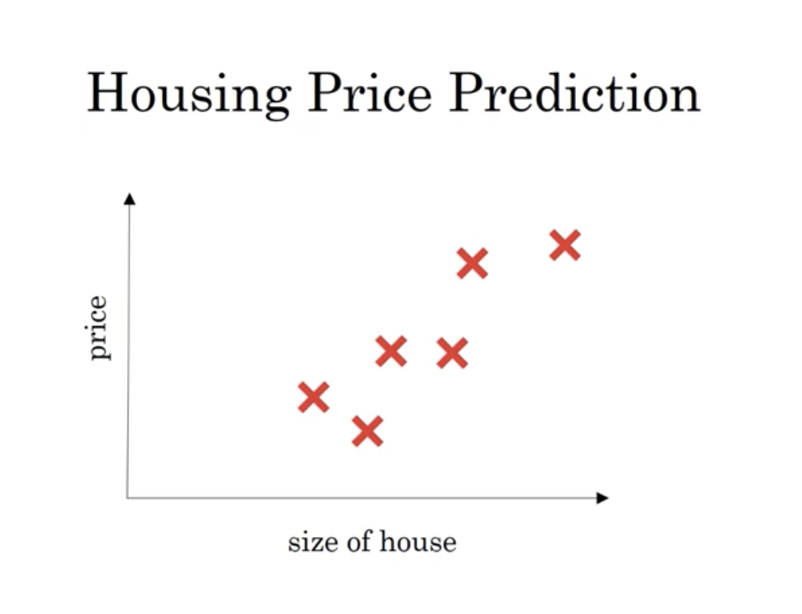
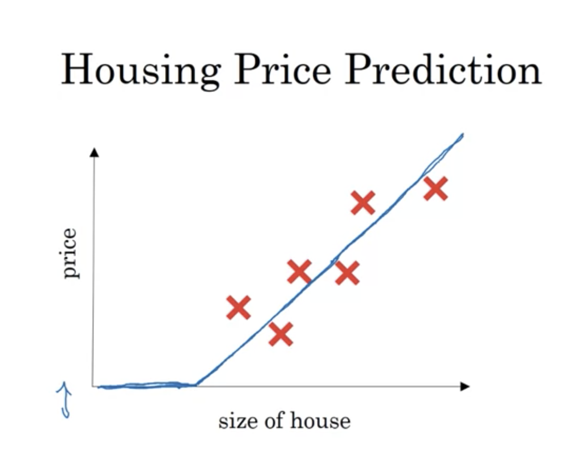
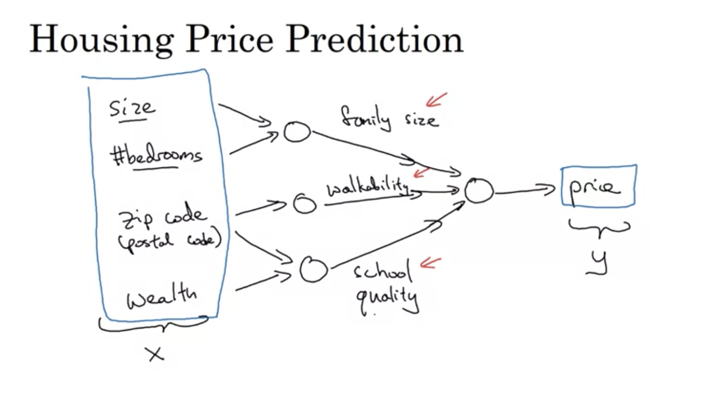
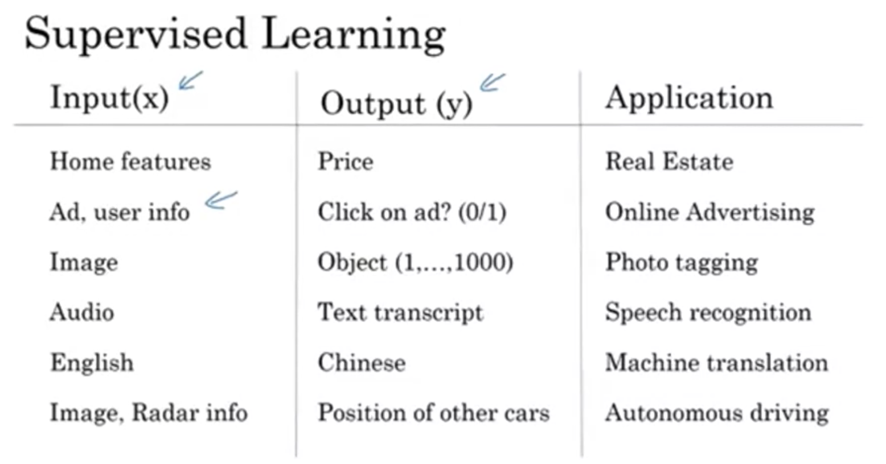
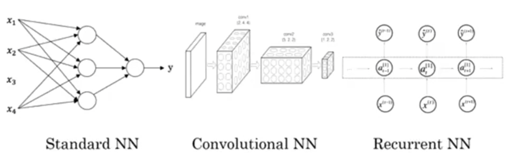

# TIL ( 2020/11/07 )
- Wath is a neural network?
- Supervised Learning with Neural Networks

---

- ### What is a Neural network?

위와 같이 집값을 예측하는 툴이 있다고 가정한다.

> 

여기서 size of house를 변수로 집값을 예측하는 일차함수 선을 긋는다고 했을때 집값은 0이 될 수 없음으로 위와같이 표현된다. 

집의 크기를 나타내는 x값을 신경망의 입력값이라고 했을때 특정 어떠한 노드(1개의 신경세포)를 통과하여 y(price)라는 결과값이 나온다. 즉, 신경세포(neural cell)가 하는것은 어떠한 입력을 받고 위에 그림과같이 일차함수를 만드는것이다.

> 

집의 크기라는 단 하나의 조건말고도 이외에 지역, 방의 갯수 등 다수에 많은 조건들이 있다고 가정 했을때 여러개의 신경세포(neural cell)들을 쌓아가면 이를 통해 그 결과값을 출력한다.

- ### Supervised Learning with Neural Networks

##### Supervised Learning

> 

위에 표를 보면 알 수 있듯이 Supervised Learning을 통해서 신경망이 영리하게 x,y값을 선정하는것으로 엄청나게 많은것들이 만들어졌다.

Home features, Ad, user info의 경우 standard한 NN이라고 할 수 있다.

Image를 활용한 Computer vision에서는 CNN(Convolution on Neural Networks)를 사용한다.

Audio, English는 시간적인 시퀀스로 가장 자연스럽게 표현되기때문에 시퀀스 데이터는 RNN(Recurrent Neural Netwrok)를 사용한다.

##### Neural Network examples

> 

structured data는 한마디로 데이터의 데이터베이서들이다. 예를 들면 집값을 예측하는데 크기, 방의 갯수 등이 있을수 있는데 이처럼 명확한 뜻을 정의하는 데이터를 갖는것이 structured data이다. Unstructured Data의 예로는 Audio, Image, Text가 있다. 

>## Reference

- https://www.coursera.org/learn/machine-learning