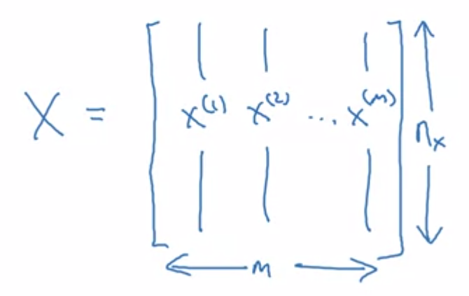

# TIL ( 2020/12/16 )

- Binary Classification
- Logistic Regression

---

## Binary Classification

고양이가 있는 이미지를 입력으로 받았다고 했을때 고양이 일대는 1, 아닐때는 0으로 y라는 label을 출력하게 되는데 이미지는 컴퓨터에서 표현될때 RGB와 같이 세 개로 분리된 행렬을 사용한다. 이 픽셀들의 채도값을 feature vector로 바꾸기 위해 RGB의 픽셀 값을 전부 하나의 feature vector로 펼치게 되면 64x64 image라고 가정했을때 전체 dimension은 64x64x3이 된다. 

우리의 목표는 이렇게 vector x로 표현된 이미지를 입력으로 주고 학습을 시켜서 출력 label y가 1인지 0인지를 예측하는 것이다. 

## Notation

앞으로 강의에서 사용 할 표기법을 정리한다(Machine learning 부분과 헷갈릴 수 있음). 

- (x,y)  => x는 x의 차원을 가진 feature vector, y 는 0 or 1의 값을 갖는 label
- m training example => (x^(1),y(2))로 첫번째 학습 데이터부터 m번째 학습데이터를 표현한다.
- 그리고 이것을 X로 표현할때 아래와 같이 한다.

  

## Logistic Regression

간단히 보면 logistic regression을 통해서 우리가 하고자하는 것은 parameter W와 B를 학습해서 예측한 값이 Y=1이 되게 좋은 결과값이 나올 수 있도록 하는것이다. 

**앞으로 1주동안은 Deep learning에 간단한 개념만을 가지고 가자(machine learning과 중복되는 부분이 있음)**

****

>## Reference

- https://www.coursera.org/learn/neural-networks-deep-learning

