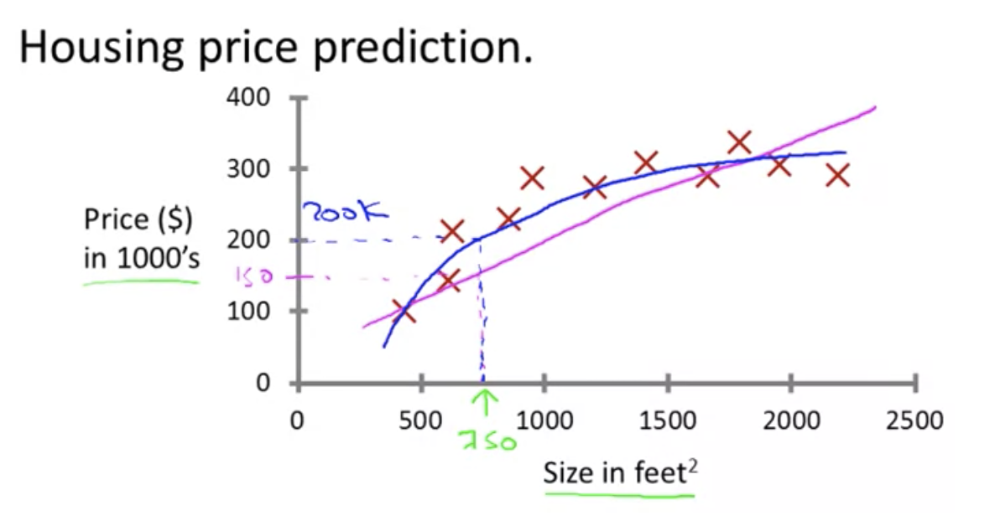
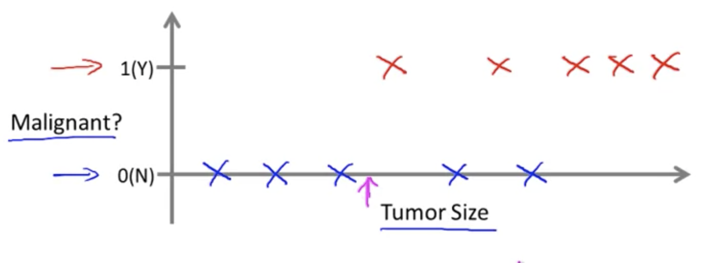
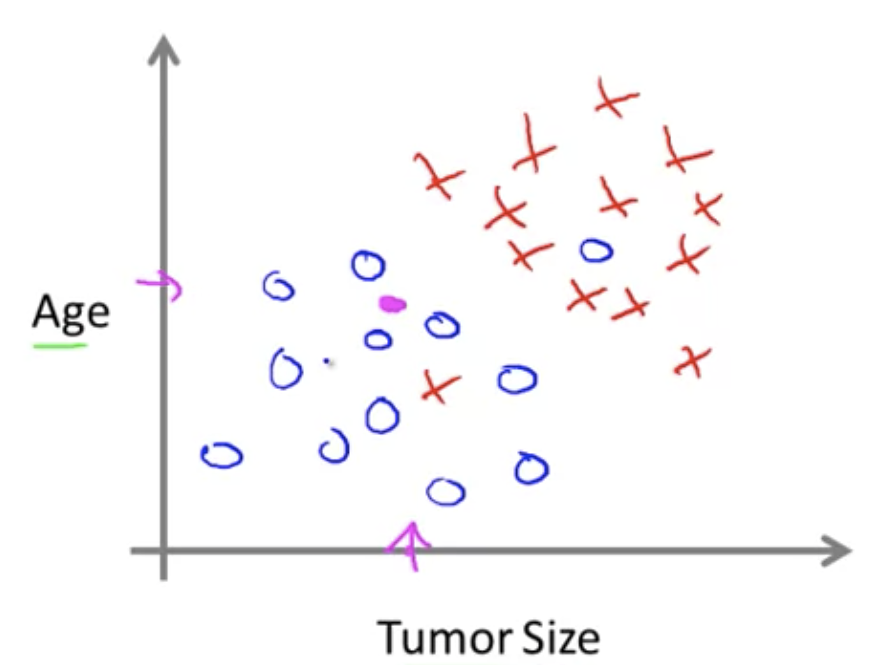
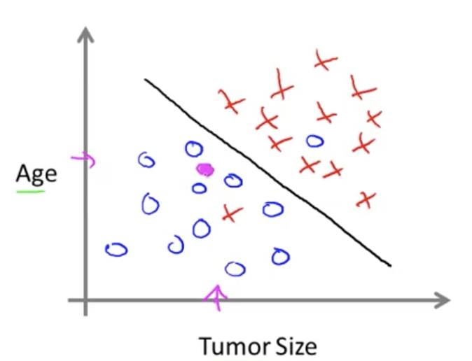
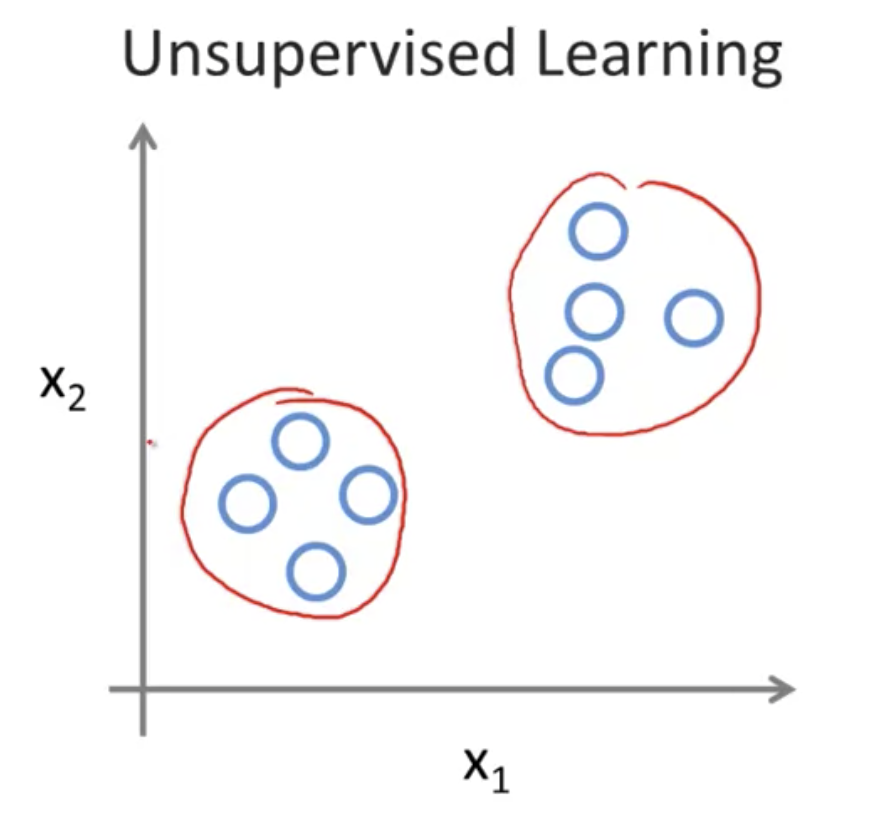
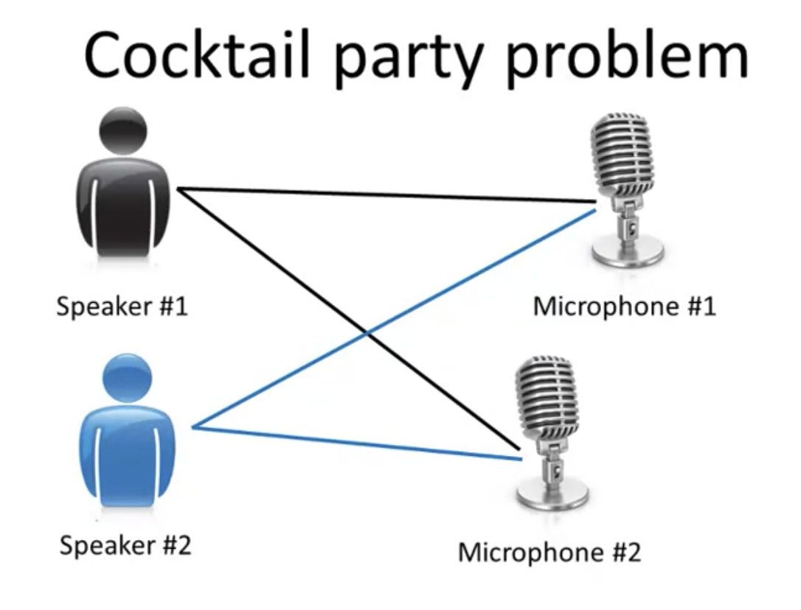

# TIL ( 2020/10/28 )
- Machine Learning 
- Supervised Learning
- Unsupervised Learning

---

> ## What is machine learning?

- Tom Mitchell의 정의 
    - machine learning은 프로그램이 일정 수준의 작업 성능(P)를 가지고 작업(T)를 수행한다고 했을때, 겅험(E)이 증가함에 따라 작업(T)를 수행하는 성능(P)이 향상될 수 있다.

- 위에 Tom Mitchell이 새운 정의를 Arthur Samuel의 체커게임으로 표현한다면
- 경험(E) : 같은 게임을 수만 번 반복하는 과정
- 작업(T) : 체커 게임을 수행하는 행위
- 작업성능(P) : 프로그램이 다음판에 새로운 상대를 만났을때 이길 확률 

> ## Supervised Learning

- ### Supervised Learning의 종류

#### 1. Regression problem(회귀 문제)

- 위에 그림과 같이 750의 크기에 집을 판매하려고 했을때 **일차 함수로 파란색의 선**을 그을수 있고 아니면 **이차함수로 분홍색의 선**을 그을수 있는데 판매가격을 어떤 것에 맞출것인가 판단을 내리는것이 supervised learning에 간단한 예이다.

- 다시 말하자면 알고리즘에게 정답이 포함되어있는 데이터의 집합을 직접 주는것이다.

- 위에 집값을 결정하는것은 연속된 값을 가진 결과를 예측하는 회귀 문제(Regression problem)이라고도 한다.

#### 2. Classification problem(분류 문제)

- 종양의 크기만을 가지고 **빨간색 x**가 악성이고 **파란색 x**가 양성이라면 아래 분홍색의 어떠한 x가 있다면 이것은 종양이 없는것이다. 

- 0또는 1, 악성 또는 양성과 같이 불연속적인 결과값을 예측하는것을 clasffication problem이라고 한다. 

#### 3. Classification problem(다수의 분류 문제)

-  환자의 나이와 종양의 크기를 안다고 했을때, 어떤 집단의 환자들이 나이와 종양의 크기를 가진다고 가정하고 표로 나타내면 해당 데이터의 집합은 위와 같이 표현 할 수 있다.

- 만약 어떤 환자 x가 종양이 있다고 했을때 그 환자 x의 나이와 종양의 크기를 분홍색점으로 표현한다고 했을때, 학습 알고리즘이 직선을 하나 그어서 악성과 양성을 분리한다. 이때 학습 알고리즘에서는 이를 토대로 어떤 환자 x의 나이와 종양의 크기를 보고 양성일 가능성이 높다고 결과를 나타낼것이다.

> ## Unsupervised Learning

- ### Unsupervised Learning

- Supervised learning에서는 label을 갖고 있었지만 Unsupervised learning에서는 label이 아예 없거나, 모두 같은 label을 갖고있다.

#### 1. Clustering algorithm

- 위에 그림을 보면 같은 label이지만 unsupervised learning에서는 서로 다른 클러스터로 구분 지을수가 있는데 이런것을 Clustering algorithm이라고 한다.

- Clustering algorithm의 활용 분야
    - 구글 뉴스 : 수천 수만가지의 새로운 기사들을 조사하여 그 기사들을 자동적으로 연관성 있는것끼리 묶어준다. 

    - 유전학적 자료 이해 : 서로 다른 사람들의 그룹에서 각 사람에 대해 특정 유전자를 가지고 있는지 또는 그렇지 않은지를 측정한다. 

    - 대규모 컴퓨터 클러스터 : 거대한 컴퓨터 클러스터를 보고 어떤 기기들끼리 주로 같이 일하는지 알아내서 이를 통해 data center를 더 효율적으로 만들수 있다.

    - 그외 소셜네트워크, 시장 세분화, 천문학 데이터 분석

#### 2. Cocktail party problem

- 두 사람이 있고 마이크가 위와같은 위치에 있다면 두 마이크에서 두 사람의 거리가 다르기 때문에 서로의 목소리 크기가 다르게 녹음 되는데, 1번 마이크에는 1번사람의 음성이 2번 마이크에는 2번사람의 음성이 크게 녹음된다고 한다.

- 여기서 1번과 2번에 녹음된 소리를 들었을때 두 음성이 겹쳐서 들리지만 1번에서는 1번사람의 음성이 더 크고 2번에서는 2번사람의 음성이 더 크게 들릴것이다. 

 - 이 녹음 파일을 칵테일 파티 알고리듬이라는 unsupervised algorithm에게 주고 해당 데이터의 구조를 찾아 달라고 했을때 1번 마이크에서는 1번사람의 음성만 분류되어 나오고 2번 마이크에서는 2번사람의 음성만 분류되서 나올것이다. 

 >## Reference
- https://www.coursera.org/learn/machine-learning