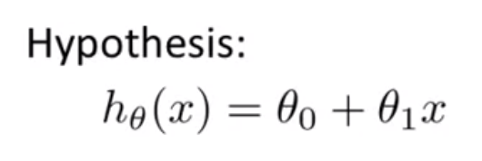
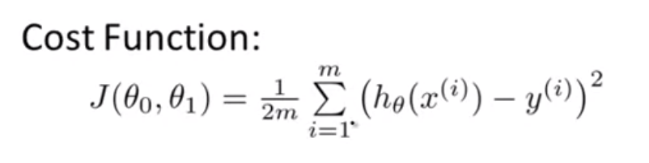
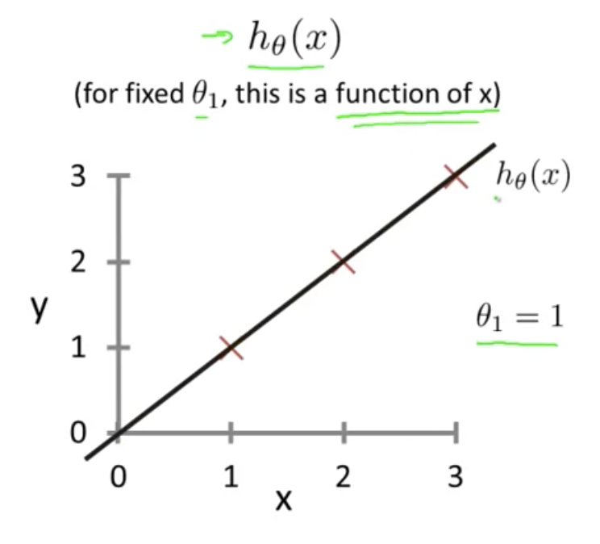
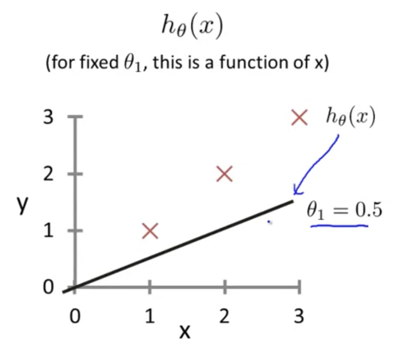
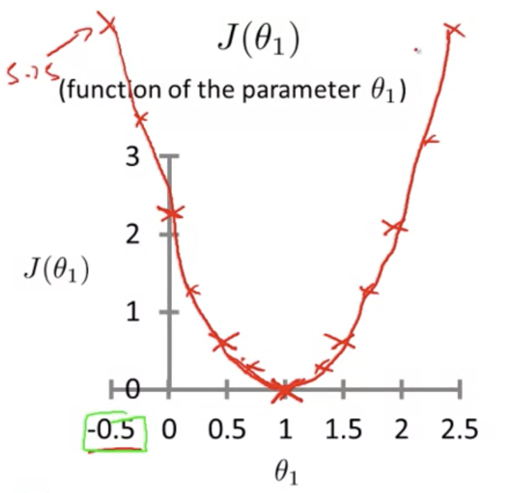
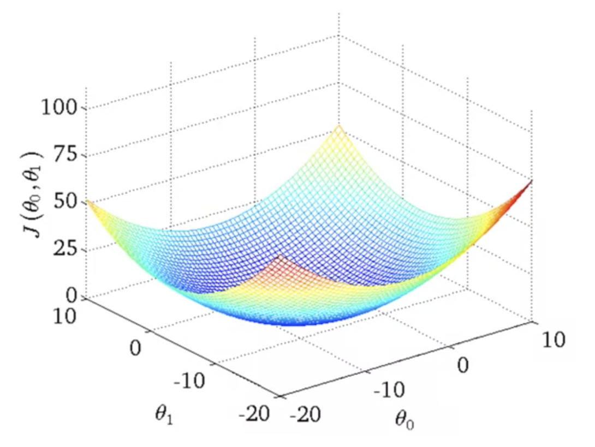
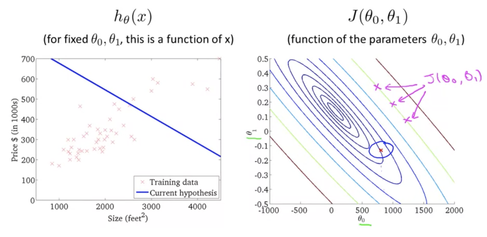
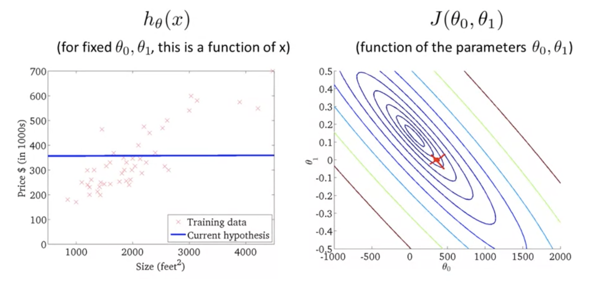
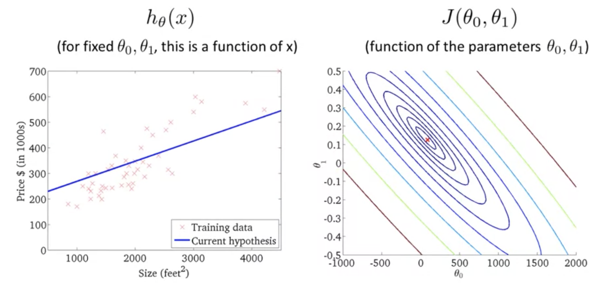

# TIL ( 2020/10/30 )

>- Cost Function(MSE)

---

> ## Cost Function(MSE)

- 이전에 Cost Function인 MSE에 대해서 살펴 봤는데 오늘은 더 자세히 들여다 보는 시간이다. 

> 

> 

- 먼저 hypothesis Function과 Cost Function(J) 두개의 함수를 이해해야 한다. 

- 위에 그림과 같이 training set이 (1,1), (2,2), (3,3) 세가지 점으로 이루어져 있다고 가정한다. 여기서 세타_1의 값은 1과 같고 hypothesis fucntion은 검은색 직선처럼 보여지게 된다. 

> 

- 세타_1 = 1 이라고 했을때 Cost Function을 계산해 보면 예측값과 실제값에 차이가 없기 때문에 0이라는 값이 나온다. 

> 

- 여기서 만약 세타_1 = 1 이 아니고 0.5라면 예측값은 위와 같이 검은선의 형태를 보이게 되는데 이때 x가 1인 지점에서 예측값은 0.5 실제값은 1이기때문에 차이가 발생하게 된다. 이것을 n번까지 다 더하고 평균을 내면 J의 값이 결정된다. 

- 신기한것은 세타_1의 값을 0, 0.5, 1, 1.5, 2, 2.5로 바꿔가며 Cost Function을 계산하여 그래프를 그리게 되면 아래와 같은.. 자주 봤던 그래프를 볼 수 있다.  

> 

- 결론적으로 Cost function을 계산한 이유는 최소화되는 지점 다시말해서, 예측한값과 실제값의 차이가 최소화되는 지점을 찾기 위해 계산한것이다. 

> ## 추가 자료 

- J(Cost Function)3차원 그래프
> 

- 2차원 그래프로 다시 나타냈을때 J에서 동그라미친 부분을 hypothesis function에 나타내면 세타0은 800, 세타1은 -0.15(기울기)로 왼쪽과 같은 직선이 나타나게 된다. 
> 

- 또다른 예로는 세타0은 500 세타1은 0으로 왼쪽과 같은 직선함수가 나타나게 된다.
> 

- 최소값에 가까운 값을 선택하게 되면 왼쪽과같은 직선함수를 볼 수 있다. 
> 
