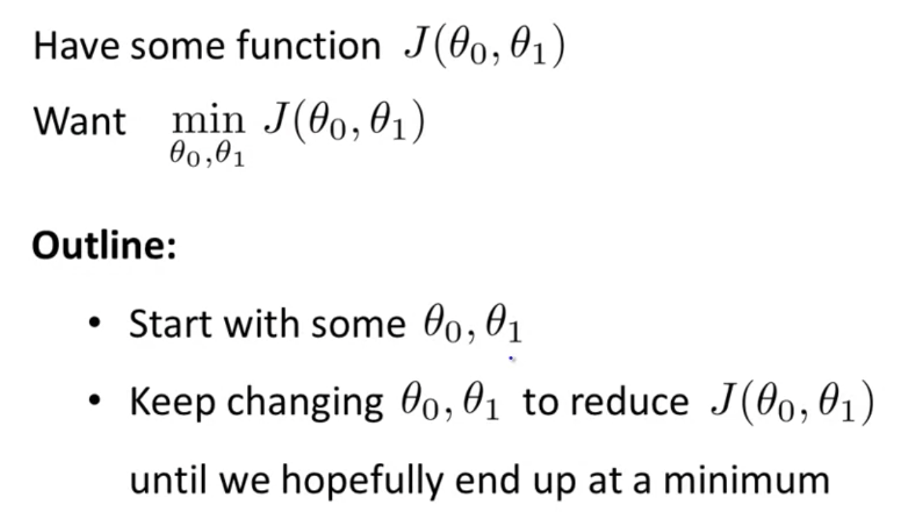
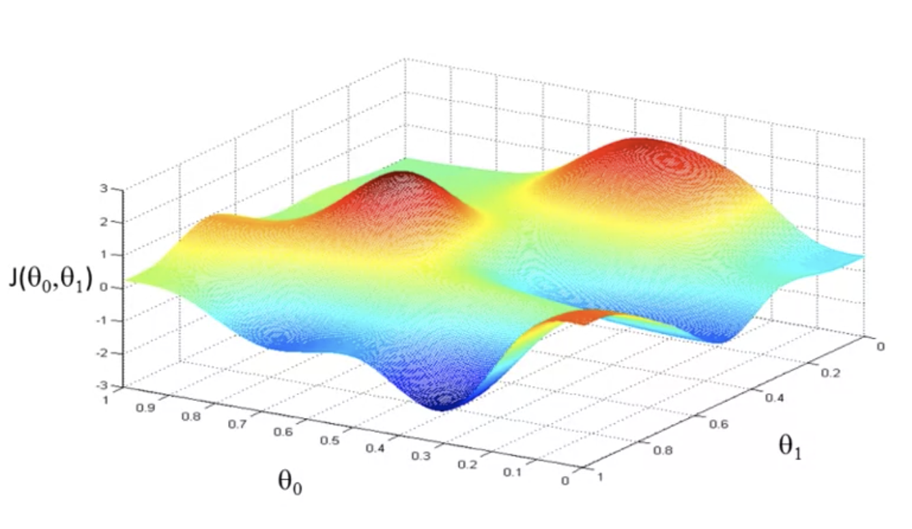
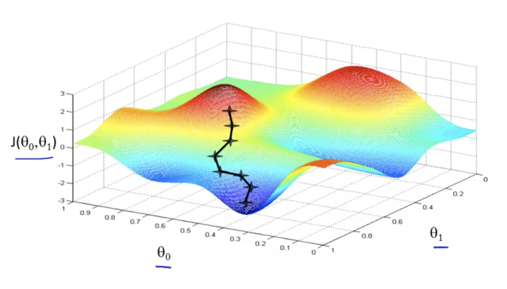
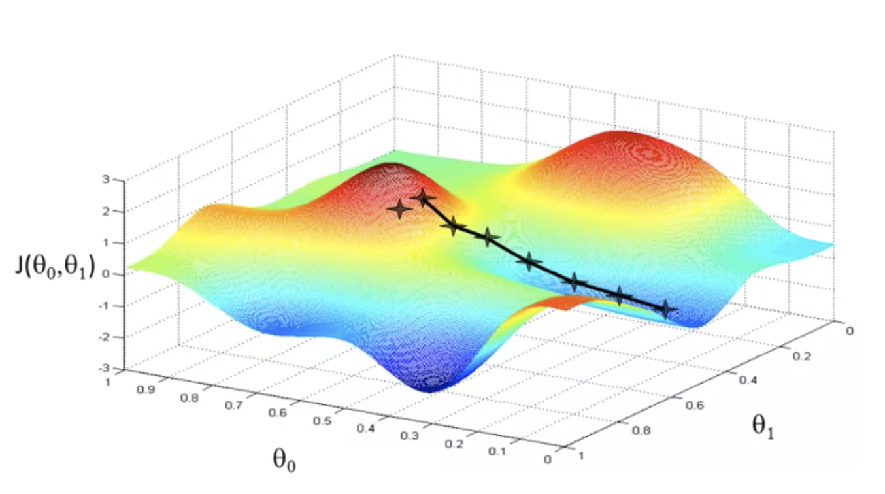
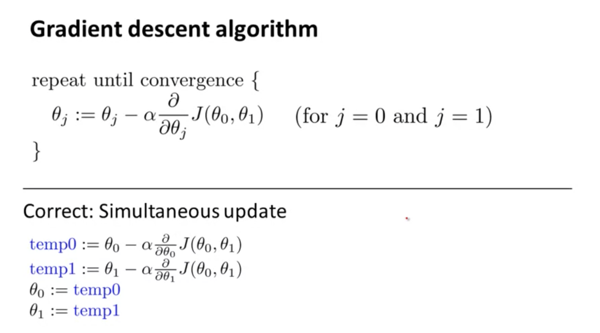

# TIL ( 2020/10/31 )

- Gradient descent

---

> ## **Gradient descent**

- 이전시간에 봤던 Cost Function(J)의 최소값을 구하는 알고리즘인 Gradient descent에 대해서 알아본다.

- 선형회귀의 비용함수인 J가 있다고 했을때 비용함수의 최소값을 구하는 알고리즘을 찾아야하는데 이럴때 Gradient descent를 활용한다.

- 간단하게 Outline을 봐보면 첫번째로 $\theta_0, \theta_1$의 초기값을 추측하여 초기화하고 이를 토대로 Gradient descent는 $J$를 최소화하기위해 $\theta_0, \theta_1$를 조금씩 바꿔간다.

- 더 자세히 설명하자면 만약 위에 함수를 최소화 시킨다고 생각해보자 축을 보면 수직축에는 비용함수인 $J(\theta_0, \theta_1)$이 있고 아래에는 $\theta_0, \theta_1$이 있다. 

- 만약 $theta_0, \theta_1$를 특정값으로 초기화하여 시작한다고 가정했을때 위에 3D그래프에서 어떠한 지점이 선택이 된다. 

- 그 다음 이 지점에서 어떤반향으로 가야 비용함수의 값이 최소화되는 부분으로 빨리 이동할수 있는지를 계산하여 위와 같이 지역적으로 최소 거리를 찾아서 두개의 파라미터 $\theta_0, \theta_1$을 선택하게 된다.

- 그렇다면 만약 처음 지점이 아닌 바로옆에 지점을 선택하면 결과는 어떻게 나올까? 결과는 아래와 같다. 

- 위 두개의 차이는 어떠한 초기값을 가지고 시작했는지가 달랐지만 결과 또한 다른것을 볼수있는데 이는 지역적으로 최적값에 도달하기 때문에 어떠한 위치를 결정하는냐에 따라 결과가 달라질수 있음을 보여준다. 

> ## **Gradient descent algorithm**

- Gradient descent를 위에서는 그래프적으로 해석해 봤다면 여기서는 수학적으로 접근해볼것이다.

- 먼저 식을 보면 $:=$기호는 Assignment operator를 뜻한다. 간단히 말하자면, $a := b$라는 식이 있을때 b의 값을 a에 씌운다는 것을 뜻한다.

- 두번째로 $\alpha$는 Learning rate를 뜻하는데 최소값에 도달하기위해 한단계를 거칠때 얼만큼 하강할 것인가를 결정하는것이다.

- $\alpha$에 뒷부분은 미분계수인데 이 부분은 뒤에서 설명하겠습니다. 

- 이 식을 토대로 $\theta_0, \theta_1$의 값을 update할것인데 그 식은 그림의 아래와 같이 쓸수있다. 먼저 temp0,1에 계산한 값을 넣고 $\theta_0, \theta_1$를 update한다. 여기서 주의할점은 temp0값을 할당하자마자 $\theta_0$ 에 대입하게 되면 temp1을 update할때 이전의 값이아닌 변경된 $\theta_0$가 할당되기 때문에 $\theta_1$에 대해 계산이 제대로 이루어 지지않는다. 

>## Reference
- https://www.coursera.org/learn/machine-learning