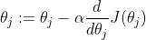
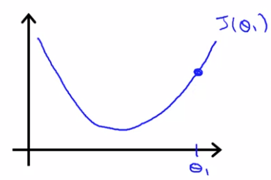
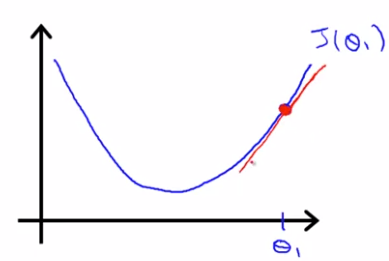
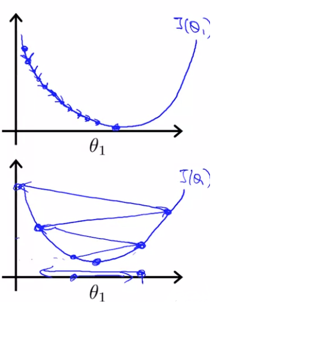
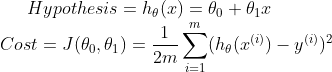
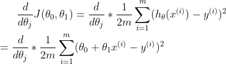
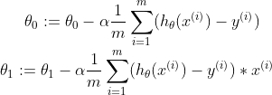
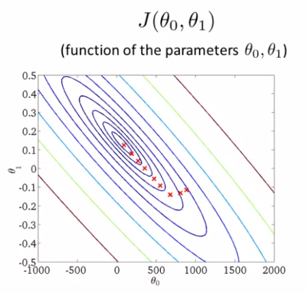

# TIL ( 2020/11/04 )

- Gradient descent intuition
- Gradient descent for linear regression

---

- #### Gradient descent intuition

오늘은 learning rate(alpha)와 미분계수 두 용어에 대한 개념을 보고 같이 사용됐을 때, 어떠한 변화가 발생하는지에 대해서 알아본다. 

- ##### Differential coefficient	

아래와 같이 j=1인 어떠한 세타함수가 있다고 했을때, 

 이때 Gradient descent의 식에서 미분계수의 역활은 해당 지점에서 tan값(기울기)을 구하는것이다. 그림으로 표현한다면 아래와 같다. 

또한 위의 그림을 보면 gradient가 양수의 값이라는걸 알 수 있고 이때는 세타값에 어떠한 값을 +해준다 만약 세타가 왼쪽 지점에 존재한다면 tan값은 반대로 음수의 값을 보이게 될것이고 이때는 세타에 어떤값을 -해준다. 

- ##### Learning rate

Learning rate 값이 크면 한번에 step에 값이 크게 변화하며 최소값에 도달하게 되고  값이 작다면 값의 변화가 적기때문에 여러번에 계산을 통해 최소값에 도달하게된다. 

아래의 그림을보면 Learning rate 가 큰것이좋다 작은것이좋다라고 정의하기에는 Learning rate의 값이 너무 크게되면 도달하고자하는 최소값에 도달하지못하는 문제가 있을수 있고 너무 작게되면 정확하지만 계산량이 많아지는 문제가 있다(적절한 값을 찾는것이 중요 물론 실험을 통해...). 

- #### Gradient descent for linear regression

Cost function과 Gradient descent를 함께 사용해서 선형회귀를 위한 알고리즘을 구하는법을 볼건데 이전에 봤던 Linear Regression Model식을 다시 보면 아래와 같다. 

여기서 Cost function값을 최소화 시킬것인데 먼저 gradient descent를 cost function에 적용시켰을때 수학적으로 식에 어떤 변화가 생기는지 알아야 한다. gradient descent를 적용했을시에 식은 아래와 같이 표현 할 수 있고, 

여기서  j=0일때와 j=1일때 두 가지 경우가 있다고 했을때 각 파라미터를 gradient descent를 적용하여 update하는 식으로 나타내면 아래와 같이 정의 할 수 있다.

이 식을 활용하여 아래와 같이 파라미터의 값을 조절하여 최소값에 도달할수있다.

>## Reference

- https://www.coursera.org/learn/machine-learning