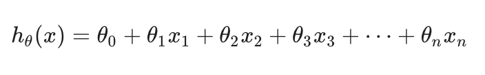
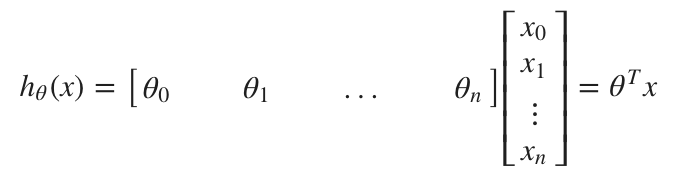
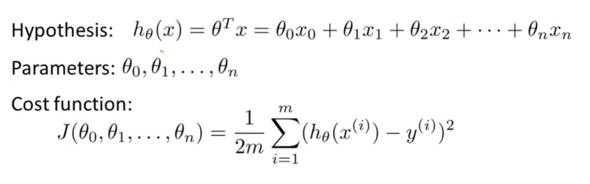

# TIL ( 2020/11/12 )

- Multiple features
- Gradient descent for multiple variables

---

## Multiple features

앞에서 본 선형회귀는 단일 feature로만 결과값을 결정했다면 오늘은 여러개의 features들을 가지고 결과값을 결정 할 것이다. 

만약 n개의 feature를 가지고 있다고 했을때 기존에 앞에서 정의했던 hypothesis의 식은 아래와같은 형태로 나타낼수있다.  

또한 행렬 곱셈의 정의를 사용하면 hypothesis식을 아래와 같이 간결하게 나타낼수가 있다. 

  

  

## Gradient descent for multiple variables

위에서 본 여러 features를 가지고 정의한 hypothesis의 식을 어떻게 지정하는지에 대해 본다. 

  

  기존에 앞에서 n개의 파라미터를 가지고 식을 세웠을때 위와 같이 Hypothesis, Parameter, Cost function처럼 정의 할 수 있는데 Parameter를 n개로 분리되어 있다고 생각하지 않고 벡터로 표현하면  &theta; 로 표현할수있고 이것은 n+1개의 차원으로 이루어져있다. Cost function에서도 J를 J(&theta;)로 벡터로 표현할수있다. 

