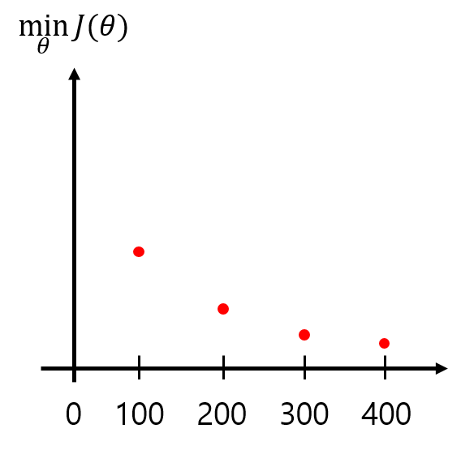

# TIL ( 2020/11/23 )

- Gradient descent in practice 2: Learning rate

---

## Gradient descent in practice 2: Learning rate

오늘 공부할것은 gradient descent를 정확하게 잘 돌아가게 하기 위한 방법인 debugging과 learning rate alpha를 결정하는 방법에 대해 알아본다.

  

먼저 gradient descent의 목적은 cost function이 최소화 되는 theta의 값을 찾는건데  x축은 gradient descent의 operation 횟수이고 gradient descent가 진행됨에 따라서 그래프는 아래와 같은 그림을 띄게 될것이다. 또한 각각의 100,200,300의 지점은 해당 크기만큼 반복했을때 나온 theta의 값을 갖고있다.

  

결국 위 그래프에서 보여주는것은 각 gradient descent를 할 때마다 나오는 cost function값이라고 할수있다. 여기서 당연히 gradient descent가 잘 작동한다면 매 반복마다 감소해야한다. 

   

##### automatic convergence test

각각의 task에 따라서 수렴하는데 걸리는 횟수는 다 다르기 때문에 사전에 알수가 없지만 자동으로 검사하는 automatic convergence test방법 이라는것이 있다. 대표적인 예로 자동으로 수렴했는지에 대해 판단 하는 기준은 cost function의 감소하는 값이 **어떤 값**보다 작을 때 즉 임계값을 설정하는 것이다. 하지만 이 임계값을 결정하는 것도 쉽지 않기 때문에 잘 사용되지 않는다(?)

##### Making sure gradient descent is working correctly

그래프를 보면서 주의해야 할 점들 이있는데 먼저 첫번째로 아래와 같이 J(theta)가 계속 해서 증가한다면 제대로 작동하고 있지 않는것이고 이런 문제는 왜 일어날까?

  

실제로 J(theta)가 증가하는 일은 아래와 같은 함수를 최소화 시키려 할때 일어나게 되는데 여기서 learning rate가 너무 크게 되면 최소값을 넘어서 overshooting이 발생하고 그림과같이 오른쪽 아래에서 시작해서 계속해서 엇나가게 되고 결국 J(theta)의 값은 증가 하게된다.

  

또 다른 안좋은 예로는 아래와 같이 J(theta)의 값이 증가, 감소가 계속해서 반복되는 그래프인데 이 런 경우에도 learning rate의 값을 작게 해주면 된다.

**하지만 learning rate를 너무 작게 해도 gradient descent가 수렴하는데 오래걸리기 때문에 적절한 값을 찾는것이 중요하다.**

  

##### To Choose alpha, TIP

강의에서 말하기를 자신은 가능한 가장 큰값과, 가장 작은값을 먼저 구하고 큰 값에서 조금 작은 값으로 반복해서 실험해서 적절한 learning rate를 찾는다고 한다. 

>## Reference

- https://www.coursera.org/learn/machine-learning