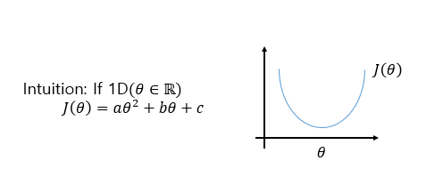
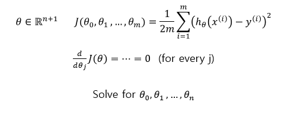
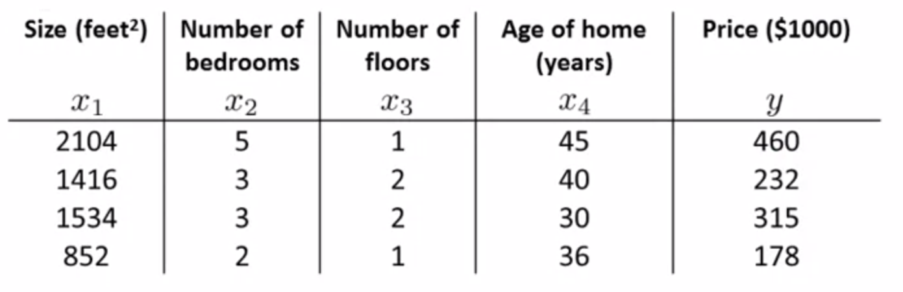
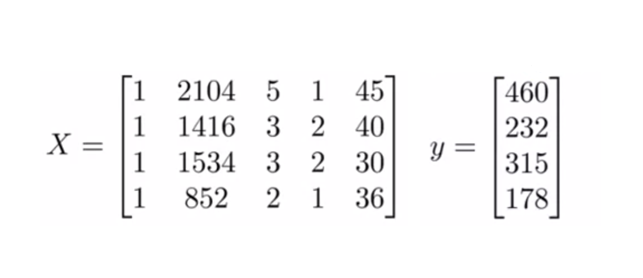
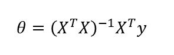
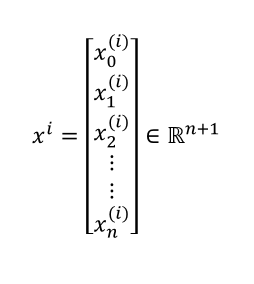
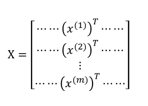
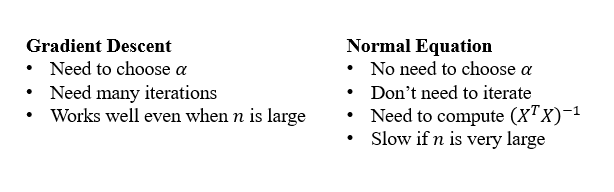

# TIL ( 2020/11/27 )

- Normal equation

---

## Normal equation

Linear regression에서 최적화를 하기 위해 사용했던 알고리즘(gradient descent)은 여러번 반복하여 J(&theta;)를 최소화 하기 위한 것이었습니다. 이것과는 반대로 normal equation은 여러번 반복하지 않고  &theta;를 분석하여 최적의 값을 구하는 방법이다. 

  

##### Normal equation?

먼저 Normal equation이 어떤 함수인지 개념부터 알아보면 아래와 같이 **실수 범위의 &theta;**에 대한 2차함수 J(&theta;)가 있다고 가정한다. 그러면 J는 오른쪽 그림과 같은 모양으로 나타나게 되는데 그럼 여기서 이 함수를 최적화 시키는 방법은 무엇이 있을까? 간단히 미분을 하면 기울기값이 나오기 때문에 미분값이 0이 되는 지점이 답이라는것을 알수가있다.

  

  하지만 우리가 다뤄야 할 문제에서는 &theta;는 실수가 아니라 n+1차원에 파라미터 벡터일 때이다.

그렇다면 이와 같이 n+1차원에 파라미터 벡터일때 cons function J는 어떻게 최소화 시켜야할까? 미적분을 이용한다면 한 가지 방법으로 두번째 식과같이 각각 모든 파라미터(0~m)를 미분하고 모두 0이 되게하는 편미분을 이용한 방법이 있다. 

  

##### 

위의 예제를 보자 4개의 training example이  있는데 normal equation을 하기 위해서는 먼저 전부 1의 값을 갖는 X_0에 대한 열을 하나 추가시켜야 한다. 그 다음 이것을 아래와 같이 training data의 모든 feature들을 내포하고 있는 행렬 X와 Y로 만들어준다.

  

그럼 X는 (m x n +1)차원 행렬이 되어있고 Y는 m차원 벡터가 된다(m = training example, n = feature 개수). 마지막으로 아래에 normal equation식을 풀게되면 cost function을 최소화 하는 값이 나오게 된다.

  

##### Example

위에 예에서는 오직 하나의 dataset에 대해 예를 들어 풀이 했지만 일반적인 경우는 m개의 training example에서 n개의 feature를 갖고있다. 그래서 각각의 training example은 아래와같이 n+1차원 feature벡터로 이루어져 있다. 

  

그럼 이것을 위에 예제처럼 행렬 X로 만들어야 하는데 그 방법은 오른쪽과 같이 벡터를 transpose하여서 가로로 길게 쭉 나열하게 되면 행렬 X를 만들수있다. 이렇게 되면 행렬 X는 (m x n +1)차원을 갖는다

  

##### Gradient Descent vs Normal Equation

m개의 training example과 n개의 feature가 있다고 가정했을때 gradient descent와 normal equation의 장단점을 보면 아래와 같다. 

  

그래서 feature의 개수를 고려해서 만약 feature(n)가 작다면 Normal Equation이 유용할수 있고 feature(n)가 크다 Gradient Descent를 사용하는게 더 좋다.

**사실 예를 들어 Classification 알고리즘 중에서도 logistic regression과 같은 정교한 학습 알고리즘에서 normal equation은 적합하지않고 gradient descent가 더 적합하다고 한다.**

  

>## Reference

- https://www.coursera.org/learn/machine-learning

