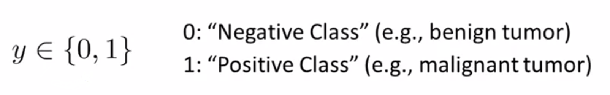
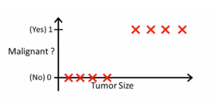
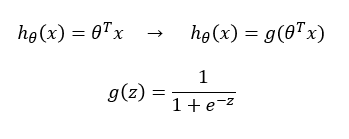
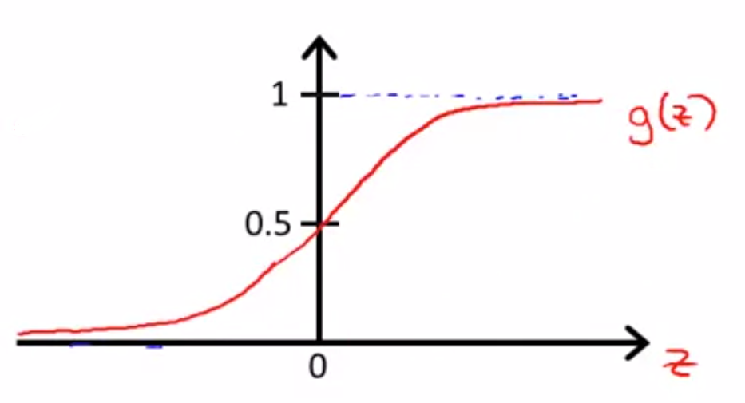
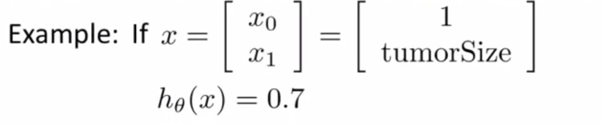
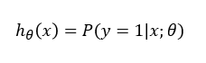

# TIL ( 2020/11/30 )

- Classification
- Logistic Regression

---

## Classification

Classification를 정의하자면 Supervised learning의 일종으로 기존에 존재하는 데이터의 category 관계를 분석해서 새롭게 관측된 데이터의 category를 스스로 판별하는것이다. 

  

간단한 예를 보자면 스팸 메일인지 아닌지를 판별하는 문제나 온라인 거래에서 특정 거래가 사기인지 아닌지 등등이 있는데 이런 문제들은 아래와 같이 0 또는 1 둘중의 하나의 값을 가지는 변수 y를 예측하는 classification문제들이다.  

  물론 0 또는 1 둘중의 하나의 값을 선택하는 binary-class 뿐만 아니라 multi-class도 있지만 이 부분은 뒤에서 다루도록 한다.

  

##### Example

아래와 같이 악석종양 혹은 양성양을 classification하는 예시가 있다.

보이는것과 같이 양성을 의미하는 0과 악성을 의미하는 1 을 분류하는 문제인데 여기서 이전에 배웠던 선형회귀를 데이터에 적용해보면

이러한 어떤 hypothesis를 얻을 수 있다. 예측을 할때 우리가 할 수 있는 건 Threshold를 이용해서 결과값이 0.5가 되는곳에 수직한 Threshold 경계선을 그어 0.5와 동일하거나 더 클 경우에 y는 1(악성종양)으로 볼 수 있고 작을 경우에는 0(양성종양)으로 판단 할 수 있다. 

  위에 방법은 linear regression과 Threshold를 사용한 예를 보여준 문제였다. 하지만 문제가 있는데 x축(Tumor Size)가 더 뒤에까지 길게 있다고 했을때 뒤에 training sample을 추가했을때 해당 data는 아무런 변화를 받지 못한다. 위에서는 간단한 예를 통해 보여주었기 때문에 잘됐다고 생각할 수 있지만 더깊게 생각해보면 결론적으로 linear regression을 통해서는 좋은 결과를 얻지는 못한다.

  

## Logistic Regression

앞서 얘기했듯이 classification의 예측값이 0에서 1사이인 어떠한 hypothesis를 만들고 싶은것인데 linear regression을 사용했을때 hypothesis function은 아래와 같았지만 Logistic Regression은 이것을 조금 변경하여 오른 쪽과 같이 g함수를 사용할 것이다. 

  

g가 바로 아무것도 모를때 딥러닝에서 자주보던 sigmoid function혹은 Logistic Regression이다. sigmoid는 1과 0에 수렴하며 z값의 수평축을 기준으로 z가 음의 무한대로 향하면 g(z)는 0으로 수렴하고 양의 무한대로 향하면 g(z)는 1에 수렴하게 된다. 

##### Example

이제 이것을 가지고 다시 위에서 예를들었던 문제에 접근해보면 input으로 어떠한 data x가 들어왔다고 했을때 y가 1일수 있는 가능성을 구한다. 예를들어 

  

어떤 feature vector(x)가 있는데 x0은 당연히 1이 될것이고 나머지 x1은 종양의 크기를 뜻한다고 가정해보자 여기서 어떤 환자들이 추가가 되고 그 환자들에 data를 넣어서 결과 값으로 0.7이라는 결과가 나왔다. 여기서 0.7에 의미는 input으로 넣어준 data를 어떤 나의 hypothesis function으로 분류했을때 그것이 1(악성종양)일 확률은 0.7 즉 70%라는 결과가 나왔다는것을 알려주는 것이다.

이것을 수식으로 써보자면 

식을 풀어서 얘기를 하면 어떤 환자의 data가  &theta;로 매개 변수화된 x로 주어지면 이것이  y=1일 가능성을 말한다. 반대로 생각하면 당연히 0~1사이의 값을 갖기 때문에 y=1일 가능성을 1로 빼주면  y=0일 가능성 또한 계산 할 수 있다.

  

**오늘은 Classification 문제에서 linear Regression을 사용하면 어떤 문제가 발생하는지 보고 Logistic Regression을 적용하여 그 문제를 해결했고 Logistic Regression이 어떤건지 살펴 보았다. 다음 시간에는 decision boundary에 대해 알아본다. **

  

****

>## Reference

- https://www.coursera.org/learn/machine-learning

