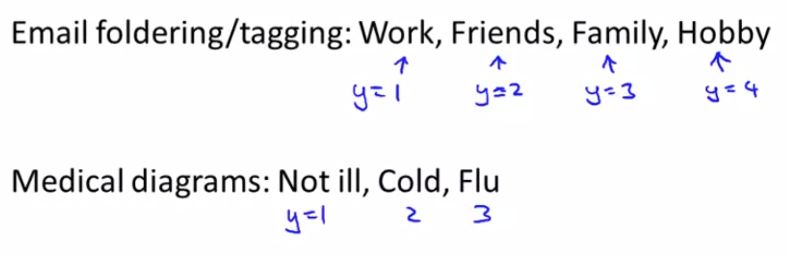

# TIL ( 2020/12/07 )

- Multi-class classification

---

## Multi-class classification

Multi-class classification에 간단한 예로 아래 두 가지를 생각해보자 email을 자동으로 여러 폴더에 분리하는 경우 각각의 폴더에 work, friends, family, hobby와 같이 4개의 카테고리로 나누어져있다고 했을때 각각을 y=1~4까지 분류, 혹은 어떤 환자가 병원에 왔는데 아래와 같이 not ill, cold, Flu와 같이  y=1~3까지 분류 할 수 있다.

  

이전에 binary classification문제의 경우 왼쪽과 같이 regression을 사용하여 간단히 해결했고 오른쪽과 같이 multi-class의 경우 어떻게 해야 할까하는 문제이다.

## One-vs-all

그래서 아래와 같이 3개의 class로 이루어져있다고 했을때 이것을 binary classification 문제로 분류하는 one-vs-all 이라는 방법이 있다.

  

class1을 먼저 보자 여기서는 새롭게 가짜 dataset 동그라미를 만들어서 class2와 class3를 대체 하고 class1을 1로 설정한다. 그리고 logistic regression을 학습시키면 binary classification과 같이 경계선이 그어지게된다. 이런식으로 class2,3을 하게 되면 세 가지의 분류를 fitting 할 수 있다.

  

다시 위 내용을 정리하자면,

- 세 개의 logistic regression을 training해서 **class i** 에 대해 **y=i**일 확률을 구했다.
- 새로운 입력값 x가 주어졌을때 예측하기 위해서는 우리가 이전에 3개의 클래스를 분류했던 classifier에 돌려 최대값이 나온 class를 x의 class로 예측을 하면 된다.

****

>## Reference

- https://www.coursera.org/learn/machine-learning
- https://wikidocs.net/4288

