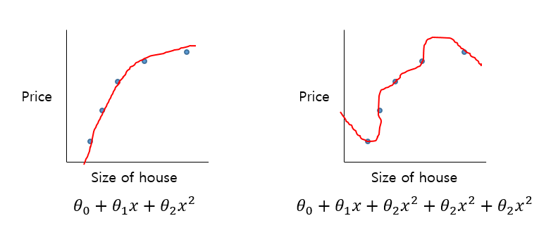
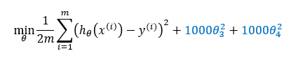
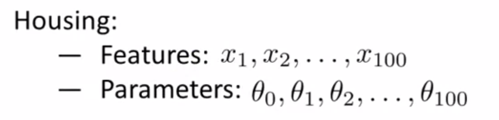
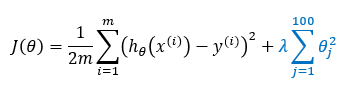

# TIL ( 2020/12/08 )

- Cost function

---

이전 시간 마지막에 얘기했던 정규화에 대해서 정규화가 작동하는 방식에 대한 방법과 정규화를 사용할 때 사용하는 const function도 함께 알아본다.

  

## Cost function

왼쪽과 같이 2차 함수로도 데이터에 잘 맞지만 오른쪽과 같이 높은 차수의 다항식을 사용했을때도 dataset에 잘 맞는 곡선을 그릴수 있다.  그러나 실제로는 overfitting이 발생 할 수 있다.

예를들어 &theta;3,4를 penalize해서 위와 같이 이 값들에 1000을 곱한 값을 cost function에 더 할 경우 새롭게 정의된 cost function을 최소화 시키는 유일한 방법은 &theta;3,4를 작게 만들어야 한다. 그래서 결론적으로 penalize를 걸어서 어쩔수 없이 &theta;3,4의 값이 0에 가까운 값을 가질수 밖에 해서 4차 함수이지만 2차 함수 모델에 거의 근접하도록 할 수 있다.

  

## Regularzation

매개 변수가 작은 값을 갖는 것은 일반적으로 간단한 hypothesis가 된다는 것이고 이럴경우 당연히 overfitting이 발생할 가능성이 줄어들게 된다. 

간단한 예로보자면, 

주택의 가격을 예측하기 위해서 100개의 feature와 100개의 parameter가 있다고 했을때를 가정해보자 여기서 당연히 우리는 어떤 feature가 영향력이 적은지를 알지 못하기때문에 일일이 하나씩 배제할수가 없다(매개변수도 마찬가지). 그래서 이것을 정규화 하기 위해서는 cost function을 수정해서 매개 변수를 축소 시킬 수 있다.

위와 같이 끝에 정규화를 추가해서 모든 매개 변수 &theta;1~100까지 축소를 할 수 있다. 여기서 &lambda;는 두 개의 다른 목표 사이의 균형을 조절 하는 것으로 하나는 training을 잘 ftting하는것과 매개변수를 작게 유지하는 것이다. 하지만 &lambda;가 적절한 값이 아닌 너무 큰 값을 가질 경우에는 모든 &theta;(parameter)들이 0과 가깝게 되기 때문에 underfit이 발생하게 된다.

  

**Regularzation은 Cost function에 매개변수에 penalize를 주어 4차 함수도 2차 함수에 근접하게 바꾸어 overffing이 발생하는 문제를 해결 할 수 있었는데 Logistic regression, linear regression등에 Regularization을 적용시켜서 overffiting을 방지 할 수 있지만 Regularization parameter의 값이 너무 클 경우에는 반대로 underfitting이 발생 할 수 있다.**

  

****

>## Reference

- https://www.coursera.org/learn/machine-learning
- https://wikidocs.net/4288

