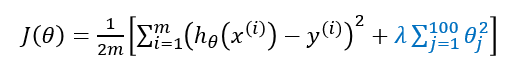
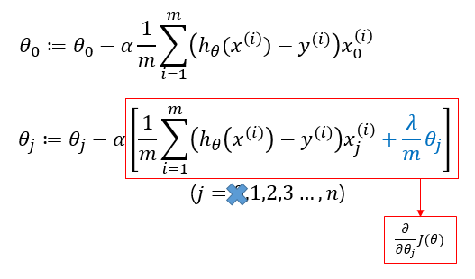
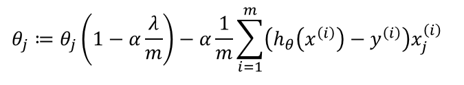
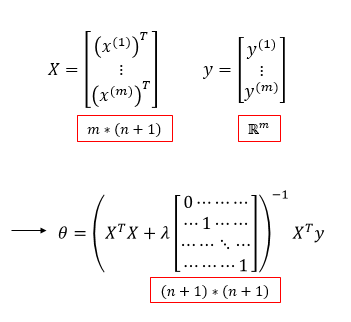

# TIL ( 2020/12/14 )

- Regularized linear regression

---

## Regularized linear regression

오늘은 Regularization을 linear regression에 적용해본다.

## Gradient descent

이전에는 Regularization없이 아래와 같이 parameter(&theta;)를 업데이트를 했다.  하지만 이제는  &theta;0에 대한 업데이트는 별도로 되어있고 regularize에 포함되지않는다. 

그 다음 이 식을 풀어서 쓰게 되면 아래와 같이 수식을 다시 쓸쑤있는데 각항이 의미하는 바가 있다.

- 첫번째 항에 1-&alpha;부분을 보면 당연히 이 부분의 결과값으로는 1보다 조금 작은 숫자가 될 것이고 만약 값이 0.99라고 했을때 &theta;의 값을 작게 만들어주는 역활을 한다.
- 두번째 항은 이전에 봐왔던 gradient descent와 동일하다.

  

## Normal equation

Gradient descent는 linear regression model을 맞추기 위한 방법중에 하나일뿐이다. 또 다른 방법으로는 이전에도 봤던 Normal equation에 방법이 있다. 

X는 m*(n=1)차원으로 이루어져 있고 y는 m차원의 벡터로 이루어져 있다. 여기서 cost function을 최소화 하는 방법은 &theta;도 맞춰주는 방법인데 기존에 앞에서 봤던 Normal equation의 방법에 Regularize를 이런식으로 할 수 있다 정도로 넘어가면 된다. 

****

>## Reference

- https://www.coursera.org/learn/machine-learning
- https://wikidocs.net/4288

