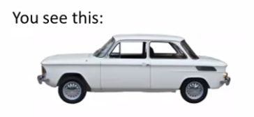
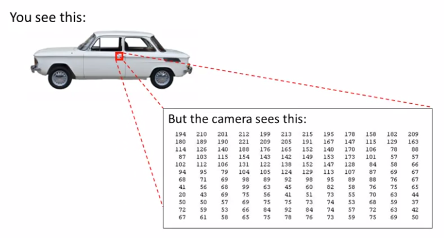
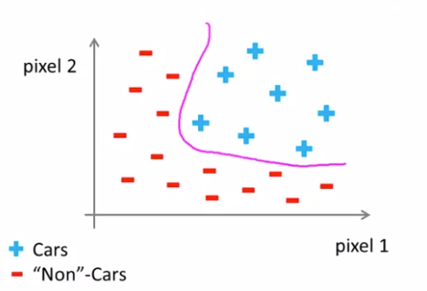

# TIL ( 2020/12/22 )

- Non-linear hypotheses

---

## Non-linear hypotheses

어떤것을 결정하는데 있어서 이차항을 가지고 100개의 feature를 분류한다고 한다면 5000개가 넘는 feature들을 포함하게 된다. 그렇기 때문에  feature가 많다고 했을때 단지 차수를 늘리는 방법으로는 문제를 해결하려고 한다면 한계가 있다. 

  

만약 아래와 같이 차가 있다고 한다면 우리는 이것을 보고 그냥 차라고 인식 할 수 있지만 

컴퓨터는 우리와 같이 한번에 인식하지 않는다. 컴퓨터의 눈으로 아래와같이 빨간 박스를 본다고 하면 컴퓨터는 픽셀값으로 이루어진 matrix를 본다.

컴퓨터 비전의 문제는 이런 픽셀값을 보고 이것이 무엇인지를 인식해야하는 문제이다.

## Computer Vision : Car detection

Machine learning을 통해서 우리가 차를 검출하기 위해서는 labeled training set(GT)를 구축해놓고 이를 통해 분류기를 학습하고 그것으로 test를 거쳐야한다. 여기서 왜 Non-linear hypotheses가 필요한지 이해 하기 위해서 예를 들어보자

차량 이미지에서 pixel1, 2와 차가 아닌 이지미 pixel1, 2를 골라서 Positive, Negative로 나눠서 표시하게되면 이 때 우리는 이것을 분류하기위해 Non-linear hypotheses가 필요하게된다.

  

그럼 여기서 feature dimension은 어떻게 될까?

우리가 50x50의 이미지를 사용한다고 가정하면 2500개의 픽셀을 사용하게 되고 2500의 feature dimension을 가지게된다(각 픽셀의 밝기).  여기서 RGB 이미지의 경우 3개의 channel을 갖기 때문에 당연 7500 feature dimesion이 된다. 이것을 학습할때 (xi*xj)의 형태로 하게 되면 이것은 3,000,000개의 달하는 feature로 늘어나게 된다. 그럼 당연히 학습 속도도 느려지게 되는데 이 문제를 해결 방법을 앞으로 강의에서 다루게 된다. 

****

>## Reference

- https://www.coursera.org/learn/machine-learning
- https://wikidocs.net/4288

