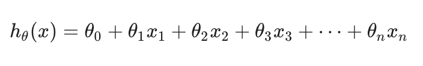
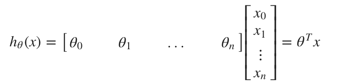
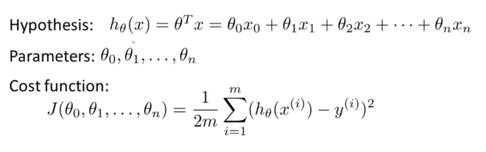
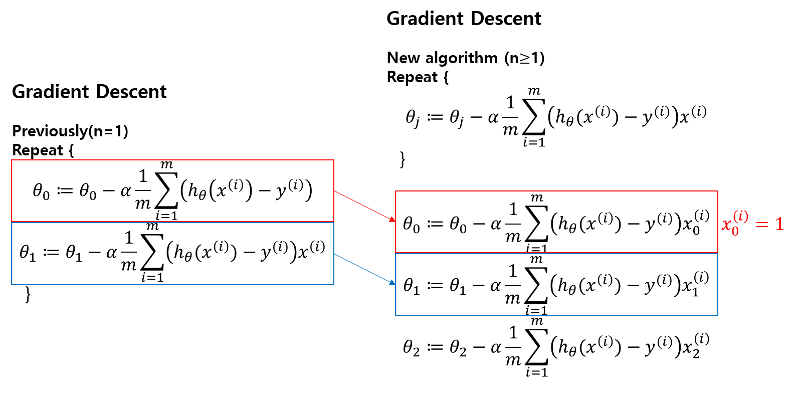

# TIL ( 2020/11/12 )

- Multiple features
- Gradient descent for multiple variables

---

## Multiple features

앞에서 본 선형회귀는 단일 feature로만 결과값을 결정했다면 오늘은 여러개의 features들을 가지고 결과값을 결정 할 것이다. 

만약 n개의 feature를 가지고 있다고 했을때 기존에 앞에서 정의했던 hypothesis의 식은 아래와같은 형태로 나타낼수있다.  

또한 행렬 곱셈의 정의를 사용하면 hypothesis식을 아래와 같이 간결하게 나타낼수가 있다. 

  

  

## Gradient descent for multiple variables

위에서 본 여러 features를 가지고 정의한 hypothesis의 식을 어떻게 지정하는지에 대해 본다. 

  

  기존에 앞에서 n개의 파라미터를 가지고 식을 세웠을때 위와 같이 Hypothesis, Parameter, Cost function처럼 정의 할 수 있는데 Parameter를 n개로 분리되어 있다고 생각하지 않고 벡터로 표현하면  &theta; 로 표현할수있고 이것은 n+1개의 차원으로 이루어져있다. Cost function에서도 세타0부터 세타n까지 오차항의 승의 합에서 구해지는데 j를 n+1에 함수로 생각하는 대신 j를 파라미터 벡터 세타의 함수라고 정의를 한다. Gradient descent의 식도 위와 같은 방법을 적용하여 모두 정리하자면 식은 아래와 같다.

  

이제 이것을 가지고 Gradient descent에 적용했을때를 봐야하는데 n=1일 경우와 n이 1보다 큰 경우를 보면 

   

  

왼쪽은 기존에 하나의 parameter를 가지고있을때 정의했던 gradient descent의 식이고 하나 이상의 요소가 있다고 했을때 오른쪽과같이 0,1,3,...n까지의 update rules를 정의 할 수 있는데 오른쪽 빨간색 처럼 해당 규칙을 따라서 했기 때문에 빨간색 박스의 식을 보면 update rule이 동일하다는것을 알수가있다. 그 다음 파란색 세타_1의 update rule을 보면 하나 이상의 요소를 가진 식을 정의 했기때문에 첫 번째 요소를 가르키기 위해 파란색 굵은 박스와 같이 새롭게 지정된다. 

간단하게 정리하자면, 

- 왼쪽 : 하나의 요소를 가지고있을때 Gradient Descent
- 오른쪽 : 하나 이상의 요소를 가지고 있을때 Gradient Descent

- 세타-0 비교 : 오른쪽 빨간색으로 표시한 식과 같이 해당 규칙을 따라서 했기때문에 세타_0 에 대한 update rule은 동일하다.
- 세타-1 비교 : 하나 이상의 요소를 갖고있는 식을 정의했기때문에 굵은 박스와 같이 첫번째 요소를 부르기 위해 해당 부분이 새롭게 지정된다.

  

>## Reference

- https://www.coursera.org/learn/machine-learning