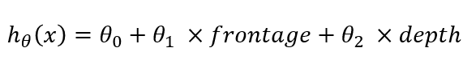
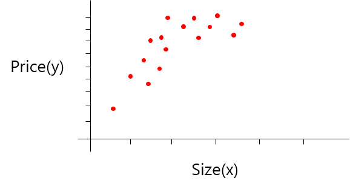
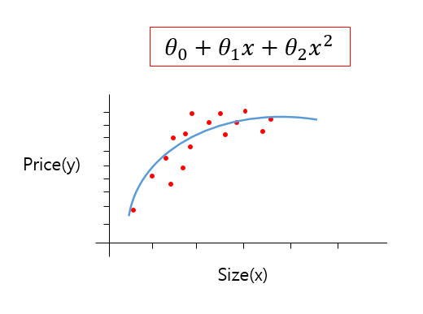
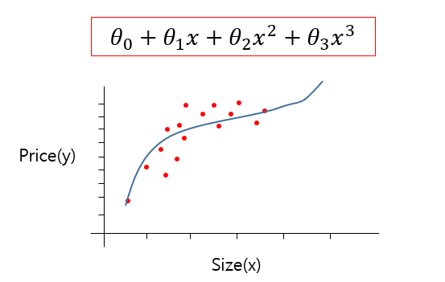
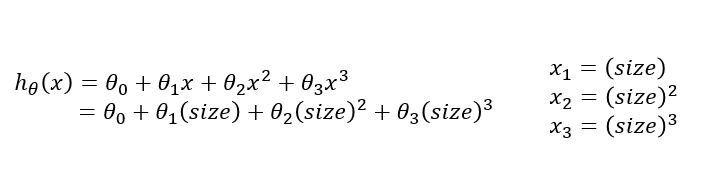
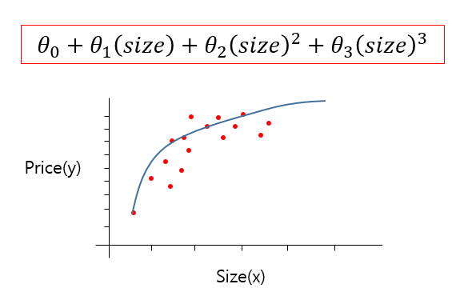

# TIL ( 2020/11/25 )

- Features and polynomial regression

---

## Features and polynomial regression

오늘은 feature를 선택하는 방법과 적절한 선택으로 강력한 학습 알고리듬을 만드는 방법에 대해서 알아본다. 또한 polynomial regression을 다루고 linear regression를 이용해 복잡한  nonlinear function에도 적용 해본다.

  

집값을 예측하는 것을 예로 보면 집의 width, height를 뜻하는 frontage와 depth 두개의 파라미터가 있다. 

  

  

linear regression에서는 x1, x2 두개의 파라미터를 사용 할 필요가 없기때문에 **frontage와 depth를 곱한 Area라는 새로운 feature를 정의**한다. 즉, 문제를 어떻게 이해하느냐에 따라서 때로는 새로운 feature를 만들어 내는것이 더 나은 모델을 정의하는것도 좋은 방법이 될 수 있다. 

##### Polynomial regression

Polynomial regression은 feature를 선택하는 것과 밀접한 관련이 있다. 아래와 같이 집값에 대한 data set이 있다고 했을때 

  

  

아래와 같이 이런 data set을 표현할 수 있는 몇가지 다른 모델들이 있는데 그 중 하나는 첫번째 식과 같이 2차식 모델이 있다. 2차식 모델을 이용하면 그림에 파란색선과 같이 data를 표현 할 수 있게 된다. 하지만 이런 2차식 모델을 이용하는 방법은 뒤로 갈 수록 하강하기 때문에 사실 적합한 방법은 아니다.

그래서 아래에 있는 3차식을 이용하면 그림과 같은 모델이 나오고 하강하지 않기때문에 적절하게 data를 표현 할 수 있게 된다. 

  

##### Multi variant linear regression

그럼 어떻게 data를 잘 표현하는 이런 모델을 만들 수 있을까? 라는 의문이 들텐데 multi variant linear regression의 구조를 이용하면된다. 오른쪽에 x1~x3까지 세개의 feature를 linear regression형태로 적용시키면 위에서 본  3차식을 아래와 같은 hypothesis function 형태로 나타낼 수 가 있다. 

  

또 한가지 위와 같은 방법을 적용했을때 중요한점은 각 feature가 제곱, 세제곱이런식으로 정의 됐기때문에 서로 다른 값으 범위를 갖게 되므로, feature scaling의 적용을 시켜야 gradient descent를 할 때 문제가 없다(11/23참고).

  

Feature를 다루는 다양한 방법이 있는데 아래 예제를 보자 위에서 2차함수를 사용하면 data를 표현하는데 적절하지 않다고 얘기를 했고 3차식 모델을 얘기했는데 이외에도 다른 좋은 방법이 있다. 그 방법은 아래 식과 같은데 이 식을 이용하면 그래프에서 보이는것과 같이 평평해지지만 하강하지는 않는 곡선을 볼수가 있다. 

  

**오늘은 2차 함수나 3차 함수를 이용해 data를 어떻게 표현하는지에 대해서 배웠고 집의 frontage와 depth를 사용하는것보다 이 둘을 곱해서 새로운 집의 면적에 대한 feature를 만들어 어떻게 feature를 유용하게 사용하는지에 대해서 배웠다.**

  

>## Reference

- https://www.coursera.org/learn/machine-learning