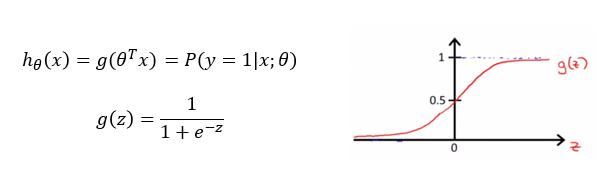
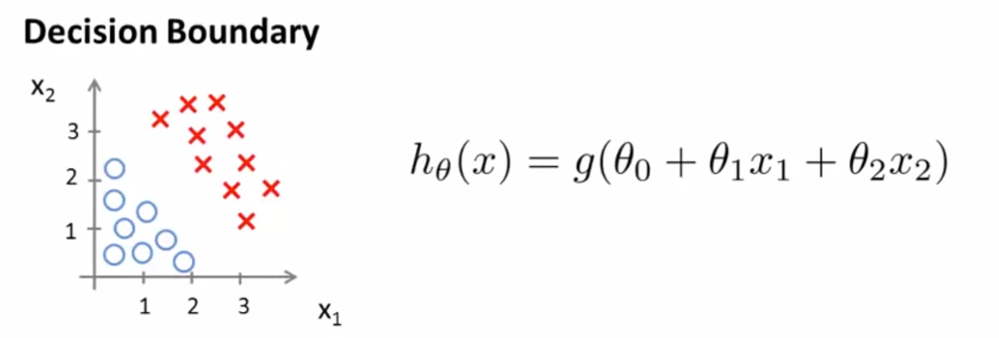
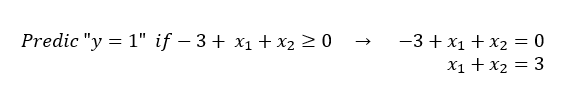
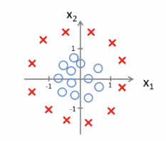
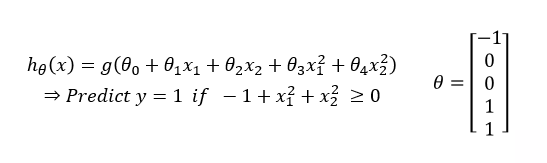
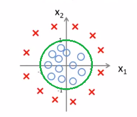

# TIL ( 2020/12/01 )

- Decision boundary

---

## Decision boundary

Decision boundary의 사전적 의미는 두 개의 계층을 가지고 있는 통계적인 분류 문제에서 기본 벡터공간을 각 클래스에 대하여 하나씩 두개의 집합으로 나누는 것이다. 

  

이전 강의에서 봤던 Logistic regression을 다시 상기해보면

feature x가 어떤 값을 가지면 y=1이 되는지 y=0이 되는지를 분류하는 것이었다. 이전 시간에는 threshold를 이용해서 hypothesis function이 0.5가 넘으면 y=1 그렇지 않으면 0이라고 정의를 했는데 sigmoid function을 보면 0.5이상이 되는 경우 z >= 0일때이고 그렇지 앟은 경우는 z < 0 일 때라는 것을 알 수 가있다. 따라서 이 말을 정리하면 &theta;(inverse)x = 0 일 때를 기준으로 y에대한 class가 나뉜다는 것이다. 

  

**Decision boundary는 y가 0, 1을 가르는 경계선을 말하고 hypothesis function에 의해 결정이 된다. **

위에서 &theta;0~2까지의 값을 찾았더니 -3, 1, 1 이었다고 했을때 이 값을 가지고 아래와 같이 결론을 낼 수 가있다.

  

즉 위에 식이 **decision boundary**이고 이것이 성립 할 경우 y=1 그렇지 않으면 y=0이 되는것이다. 이 식을 오른쪽과 같이 바꿀 수 있는데 이걸 다시 해석해보면 x1+x2가 3보다 크거나 같을때 y=1로 예측을 할 수 있고 그림으로 나타내면 아래와 같은 직선으로 데이터를 분류할 수 있다.

  

**Decision boundary**는 &theta;로 결정된다는 것을 기억해야 하고 Training data는 parameter를 결정하는데 이용할 뿐 decision boundary 에 직접적으로 영향을 미치지 않는다.

  

## Non-Linear decision boundaries

위에서는 linear task에 대해서 얘기를 했다면 이번에는 아래와 같이 데이터가 분포되어 있을때 decision boundary를 결정 하는 방법이다. 이전에 linear에 대해서 이야기 할때 2차함수(직선)로 해결하지 못한 문제를 더 높은 차수의 다항식을 추가해서 푸는 방법을 얘기했었다. 

  

위와 같이 hypothesis function이 있을때 다섯 개의 매개 변수를 갖고 있는것을 볼 수 있는데 이 parameter를 결정 하는 방법에 대해서는 다음 시간에 다룰것이고 임의로 &theta;의 값이 다음과 같다고 했을때 우리는 y=1일 경우를 위와 같이 예측 할 수 있다.

**결론적으로 위에서 linear한 문제에 대해서는 2차 함수로 간단히 해결했지만 직선으로 해결되지 않는 분류 문제에서는 이렇게 feature dimension을 높이는 방법을 통해서 non-linear decision boundary도 표현 할 수 있다.**

****

>## Reference

- https://www.coursera.org/learn/machine-learning
- https://wikidocs.net/4288

