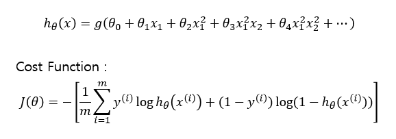
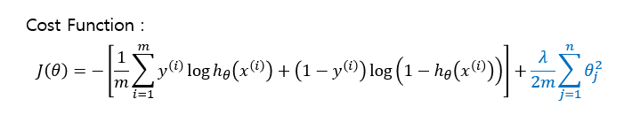
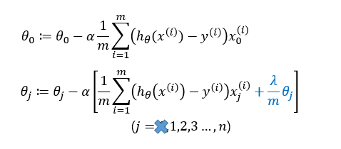

# TIL ( 2020/12/15 )

- Regularized Logistic regression

---

## Regularized Logistic regression

이전 Logistic regression강의에서 높은 차수의 다항식을 사용 할 경우 'Overfitting'이 발생하기 쉽다는것을 보았다. 

Logistic regression에서 위와같은 hypothesis를 봤고 아래에 있는 Cost function도 정의 해봤는데 여기서 정규화를 사용하기 위해서는 아래와 같이 수정을 해주어야한다.

이렇게 정규화를 적용하게 되면 기존에 발생했던 Overfitting을 다소 방지 할 수 있는 효과가 있다.

  

## Gradient descent

그러면 Gradient descent는 어떻게 적용해야 할까? 바로 직전 강의에서 &theta;0을 따로 분리하여 업데이트 해주었는데 이 방법과 동일하다. 

어떻게 보면 linear regression과 동일하다고 생각 할 수 있지만 Logistic regression에서 hypothesis는 sigmoid가 적용된 식이기 때문에 동일한 알고리즘이 아니다.

****

>## Reference

- https://www.coursera.org/learn/machine-learning
- https://wikidocs.net/4288

