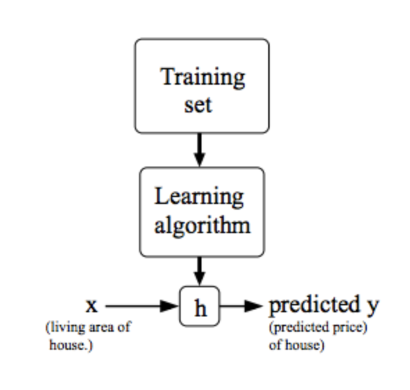
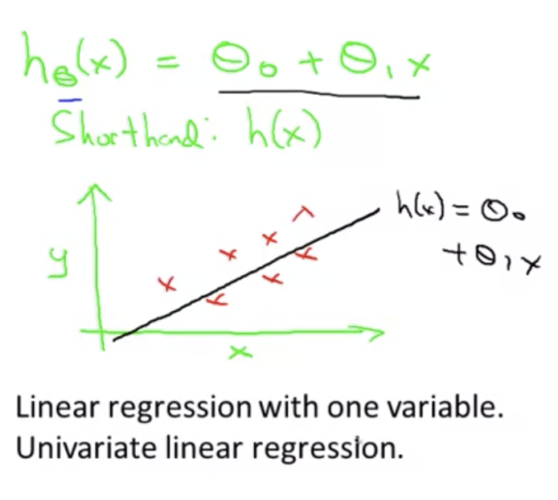
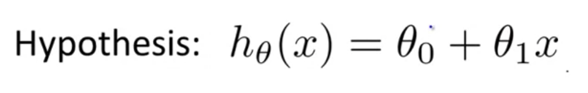
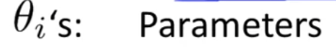
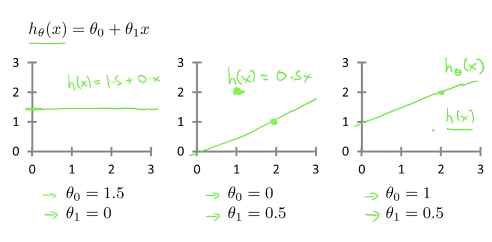
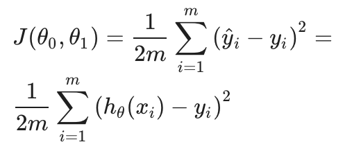

# TIL ( 2020/10/29 )

- Model representation
- How do we represent h?
- Cost Function(MSE)

---

> ## Model representation

- 예를 들어 주택 가격을 예측하는 알고리듬의 전체적인 구조를 살펴보자면 아래와 같다.

- Training Set : 주택 가격에 대한 training set을 학습
- Learning Algorithm : Suervised learning을 사용
- h : 알고리즘을 거친후 나오는 어떠한 가설(hypothesis)
- 여기서 h는 어떤 가설을 뜻하는데 그 가설은 어떤 사람이 팔려고 하는 새로운 집의 사이즈를 x에 입력값으로 받고 그에 대한 결과값으로 주택에 대한 가격 y를 도출한다. 

> ## How do we represent h?

supervised learninng을 위에 그림과 같이 디자인할때 다음 으로 우리가 결정해야 하는것은 h를 어떻게 표현할것 인가이다.

h를 다음과 같이 h&theta;(x) = &theta;0 + &theta;1x라고 했을때 이 것을 다시 h(x)라고하고 아래 그래프로 표현하면 x의 선형함수인 y를 예측하는것이다. 그리고 이 직선함수는 h(x) = &theta;0 + &theta;1x이다. 

이것은 선형회귀 또는 단일변량(one variable) 선형회귀이고 하나의 값 x로 모든 가격들을 예측하는 것이다.

> ## Cost Function

Cost Function을 사용하면 주어진 데이터에 가장 가까운 일차함수 그래프를 알아 낼 수 있는데, 먼저 위에서 hypothesis에 대해 나타냈던 식을 살펴보자 

h(x)에 식에서 세타는 파라미터를 뜻하는데 Cost Function을 통해 어떻게 이 2개의 파라미터를 정할 것인지를 볼것이다.

먼저 hypothesis function이 다음과 같이 세개가 있다고 했을때 아래 그림에서 x는 집의 크기 y는 집의 가격이라고 했을때 이런 선형회귀 training set을 가지고 있다고 가정한다. 

여기서 우리는 어떠한 파라미터 2개의 값을 통해 일차함수를 구하고 training set과 얼마나 일치하는지를 봐야한다. 즉, 예측값-실제값이 최소화가 되어야 하고 식으로 정의하면 아래와 같고 squared error function 혹은 Mean squared error라고 부른다.

이러한 cost function은 대부분의 회귀문제에서 통상적으로 잘 작동한다.

>## Reference

- https://www.coursera.org/learn/machine-learning