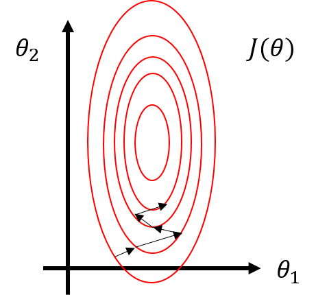
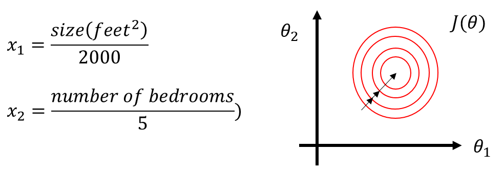

# TIL ( 2020/11/23 )

- Feature Scaling

---

## Feature Scaling

서로다른 Feature의 단위크기가 비슷하다면 즉, 범위가 같다면 gradient descent가 빠르게 수렴할수있다. 구체적으로 아래에 예를 보자

  

- x1 : 집의 크기로 0~2000사이에 값을 가진다.
- x2 : 침실의 수로  1~5사이에 값을 가진다.

  

만약 위에 parameter를 가지고 Cost function graph를 그린다고 한다면 아래와 같은데, 세타0~2까지 가 있지만 여기서 세타_0는 고려하지 않는다.

  

  

x1의 범위가 x2보다 크기때문에 그래프는 뾰족한 타원형을 보여주고 gradient descent를 적용하면 지그재그로 움직이며 오랜 시간에 거쳐서 최소값에 도달하게 될것이다. 

   

이럴때 사용하는것이 바로 Feature scale이고 위의 예제에 적용해서 아래와 같이 식을 세워서 그래프를 다시 그려보면 오른쪽과 같이 이전보다는 덜 뾰족한 원으로 그릴 수 있게된다. 여기에 다시 gradient descent를 적용하면 더 정확하게 올바른 방향으로 최소값을 찾아나갈수 있게 된다. (예를 들면 x1, x2의 값을 0~1 사이의 값으로 조정)

  

##### Feature scaling exception

보통 feature scaling은 -1~1사이 범위에 값을 갖는데 사실 이 범위는 중요하지 않다(사람마다 기준이 다름). 하지만 예외의 경우가 있는데 예를 들어 x1~3이 있다고 가정했을때 

- x1(0~3)  : 가능
- x2(-2~0.5)  : 가능
- x3(-100~100)  :  불가능 ! 이 경우에는 x3는 -1과 +1과는 완전히 동떨어진 범위가 되기때문에 좋지않다.

그렇다면 -1~1부터의 값보다 더 작은 범위를 갖는다면 어떻게 될까?

만약 x4(-0.0001~0.0001)의 범위를 갖는다면 이 역시 -1~ 1보다 너무 작은 범위이기때문에 feature scaling이 필요하다.

  

##### Mean normalization

Mean normalization은 간단히 말하면 featurex_i 를 -로 바꾸면되고 그러면 feature 의 평균이 0에 가까운값이 된다. 여기서 x0는 모두1이기 때문에 사용하지않는다 

집의 크기(x1)가 0~2000이고 평균 집의 크기가 1000이라면 식은 아래와 같이 평균값을 빼서 값을 구할 수 있고 침실의 개수의 평균이 2 라고 했을때 같은 방법으로 아래와 같이 mean normalize를 할 수 있다.

식을 좀 더 자세히 보자면 x1에서 1000은 x1의 training set에 평균값이고 분모에 2000은 feature의 최대값 - 최소값으로 적용 될 수도 있고 표준편차의 값을 알고있다면 표준편차로 정의해도 무방하다. 이렇게 계산을 하게되면 위와 같은 범위에 값들이 나오는것을 볼수있다. 

  

**결론 적으로 이런것들을 적용하는 이유는  Feature scaling을 적용시키면, gradient descent는 더 빨라지고 적은 수의 반복으로도 최소값에 빠르게 도달할수 있기 때문이다.**

  

>## Reference

- https://www.coursera.org/learn/machine-learning