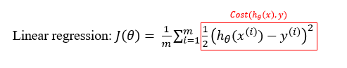
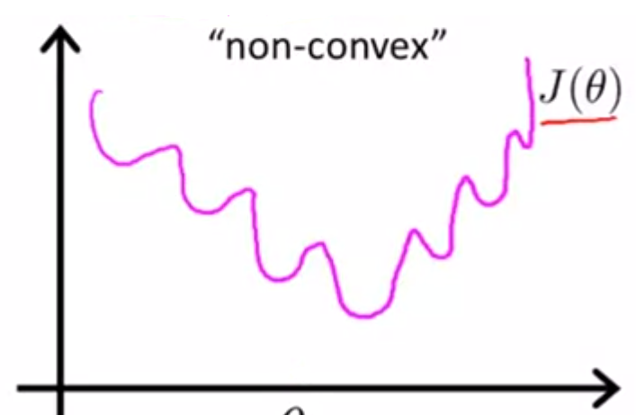
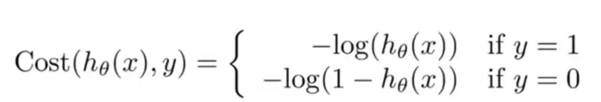
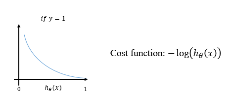
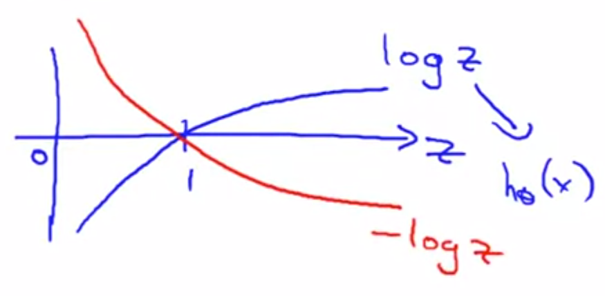
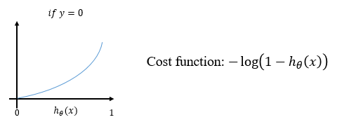

# TIL ( 2020/12/02 )

- Cost function

---

잠깐 linear regression으로 돌아가서 아래와 같이 수식을 정의했었는데 이 식에 뒷부분을 바꾸게되면 실제 관측된 값의 차를 제곱한 값이 된다. 

이렇게 정의된 cost function은 linear regression을 다룰때는 문제가 없었지만  logistic regression에서 cost function으로 사용한다면 non-convex하게 된다. 그렇기 때문에 아래와 같이 많은 극소점들을 갖기 때문에 local optima에 빠질 수 있다.

## Logistic regression Cost function

Logistic regression의 cost function은 아래와 같다.

  

이 식이 좀 복잡해 보이지만  하나씩 아래에 그림을 보면서 이해해보자 먼저 **y=1**일때를 보면 아래와 같다.

  

y=1일경우, cost function은 오른쪽과 같고 x축을 h(x)라고 했을때 cost function을 plot하면 왼쪽과 같은 그림을 볼 수 있다. 이 그림이 이해가 안된다면 -log(z)를 그려보면 아래 그림과 같이 1을 기준으로 1보다 클 경우 무한대로 가는 그림을 볼 수 있을거다.

다시 본론으로 돌아가서 이 Cost function이 갖는 특징들이 있는데 정리하면 아래와 같다.

- y=1인 경우, h(x)=1 ( 정확히 예측한경우 ), Cost = 0
- h(x)가 0에 가까워 질경우에는 Cost = 무한대

  

이번엔 **y=0**일 경우를 보면 아래와 같은 그림과 cost function을 볼수 있다. 

  

---

오늘 내용을 좀 정리해서 말하자면

- Linear regression에서 사용했던 cost function을 그대로 사용 할 경우 logistic regression에서는 non-convex한 문제가 발생하고 새로운 cost function을 공부했다.
- log를 활용해 원하는 값에 도달할 수록 cost=0에 가까워졌고 반대로 엉뚱한 답으로 갈 경우 cost는  무한대에 가까워졌다. 

- 우리가 원하는 정답이 1일 경우에 예측을한값도 1일 경우  cost = 0이고 h(x)가 1에 가까워지면 0에 가까워지고, 0에 가까워질 경우 무한대로 간다.
- 우리가 원하는 정답이 0일 경우에 예측을 한 값도 0일 경우 cost = 0이고 h(x)가 1에 가까워지면 무한대로, 0에 가까워지면 0에 가까워진다.

****

>## Reference

- https://www.coursera.org/learn/machine-learning
- https://wikidocs.net/4288

