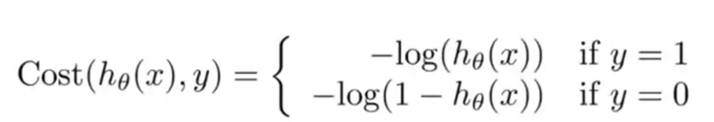
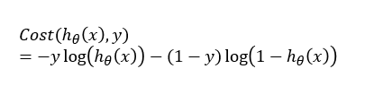
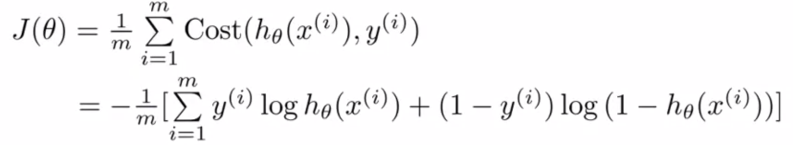
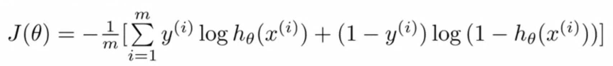
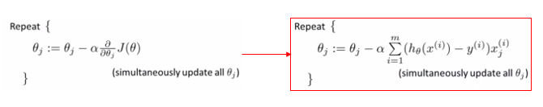

# TIL ( 2020/12/03 )

- Simplified cost function and gradient descent

## Simplified cost function

이전 시간에 봤던 Logistic regression cost function을 더 간단하게 만드는 방법에 대해서 알아본다. 이전에 봤던 식들을 다시 보면 아래와 같은데 

Cost function 부분을 더 간단하게 식을 세우면 오른쪽과 같이 수식을 쓸 수 있다. 

  

식은 당연히 원래의 식과 동일하지만 더 압축을 시킨것으로 생각하면되고 y=1, y=0인 경우를 예를 들어보면 y=1일 경우 식을 풀어보면 첫 번째 항만 남게 되고 원래 식과 일치하는것을 볼 수 있고 y=0이라고 했을때 두번째 항만 남게 되고 원래 식에서 변함이 없는것을 볼 수 있다. 그리고 최종적으로 logistic regression의 cost function은 다음과 같이 표현한다.

  

물론 다른 cost function을 사용 할 수있지만 이 cost function을 사용하는 주요한 이유는 아래와 같이 두가지 특징을 갖기 때문이다. 

- Maximum likelihood estimation criterion
- Convex

  

이제 이 cost function을 사용하여 최적의 &theta;를 찾으려면, J(&theta;)의 최소화 하다보면 몇개의 &theta;를 구하게 될텐데 새로운 x를 어떤 class에 넣을지 sigmoid function의 값이 0.5보다 큰지 작은지를 확인하면 된다.

  

## Gradient descent

  

우리는 이 cost function을 최소화하는 &theta;를 찾는 것이 목적이고 convex하기 때문에 gradient descent를 이용해 최적에 &theta;를 찾을 수 있다. 

gradient descent 식을 다시 상기 시켜보자 그리고 이 식에 cost function을 적용해서 풀게되면 오른쪽과 같이 정의 할 수 있다.

  

  

신기하게 이 식을 사용해서 푼것이 linear regression의 gradient descent와 같은데 그럼 이런 의문이 생긴다 linear regression과 logistic regression이 서로 다른건가? 이 둘의 차이점은 hypothesis function을 살펴 보면된다 외관상 동일하게 보이더라도 실제로 hypothesis function은 다르기 때문에 서로 사용하는 gradient descent는 다르다고 할 수 있다. 

****

>## Reference

- https://www.coursera.org/learn/machine-learning
- https://wikidocs.net/4288

