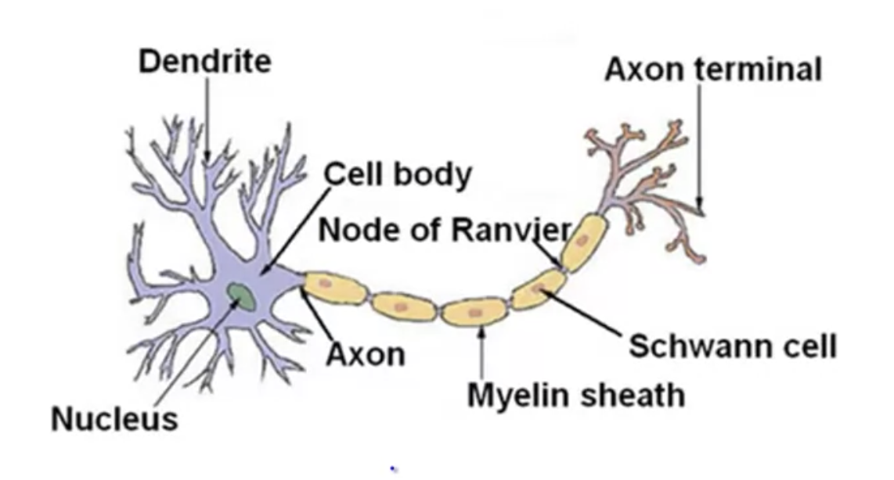
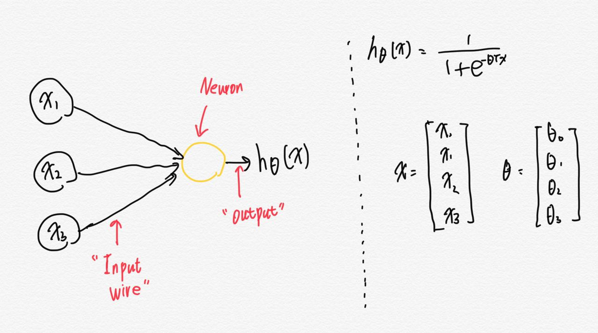
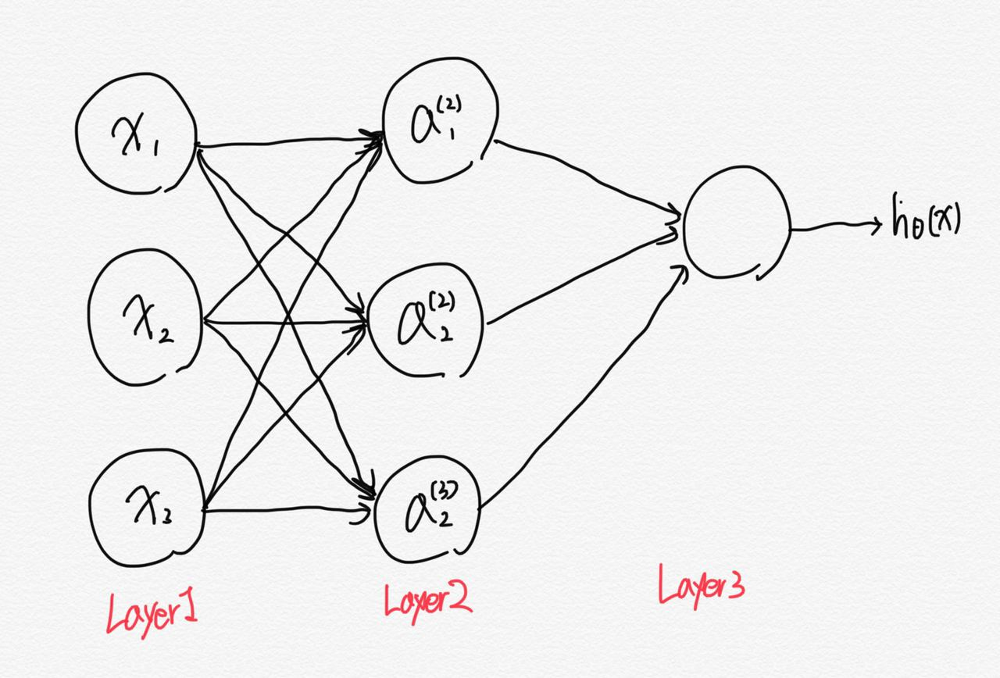
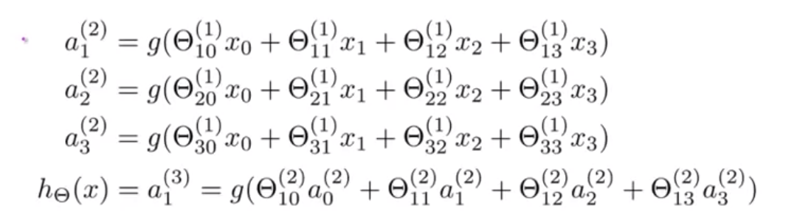

# TIL ( 2020/12/23 )

- Neurons in the brain
- Neuronn model: Logistic unit

---

## Neurons in the brain

신경망은 뇌속의 뉴런이나 뉴런의 연결망처럼 보이게 만들어 졌다.

뇌는 뉴련으로 빽빽하게 차있고 여기서 뉴런은 입력을 받을 수 있는 많은 dendrite가 있고 출력을 담당하는 axon가 있다. axon는 다른 뉴런으로 신호를 전달한다. 

  

## Neuron model: Logistic unit

뉴런이 동작하는 방식을 단순하게 예로 들어보자면 아래와 같다,

동그라미 하나하나는 각각의 neuron을 의미하고 input wire(dendrite)를 통해 neuron에 전달 되면 어떠한 계산을 한 뒤 output(axon)이 나오게된다. 그리고 x와 &theta;는 parameter vector이다. 

  

## Neural Network

위에서는 하나의 뉴런을 가지고 예를 들었지만 실제 인공 신경망은 여러개의 뉴런으로 구성이 되어있다. 아래 그림을 보자,

input으로 x1~3이 있는데 (x0은 생략) 각각 Layer2에 뉴런들과 연결되고 최종적으로 하나의 뉴런과 연결된것을 볼 수 있다. 보통 Layer1은 input layer라고 하고 Layer3과 같이 마지막은 output layer그리고 그 중간에 존재하는 layer들은 hidden layer라고 부른다. 

  

## Neural Network Calculation

이런 인공 신경망을 계산되는 과정을 보기에 앞서 몇가지 용어를 정리하면 

- a는 layer "j"에 있는 뉴런 "i" 혹은 unit "i"의 activation을 뜻한다.
- &theta;는 다른 layer로 mapping되는 함수를 조절하는 weight의 matrix를 뜻한다.

  

  

위에 그림과 같은 Network를 식으로 나타나게 되면 아래와 같다.

식을 간단히 설명하면  첫번째 줄을 보자, 여기서 g는 sigmoid(activation)을 뜻하고 세타에 윗 첨자는 1로 layer1을 뜻한다. 여기서 x0이 왜 있나 싶겠지만 bias이기때문에 생략이 가능하기때문에 그림에는 따로 넣지 않았다고한다. 그리고 두번째 항을 해석해보면 layer2에 첫번째 neuron과 x1을 mapping한것이고 세번째항은 첫번째 뉴런과 x2를 mapping한것이다. 이렇게 x0~3까지 모두 mapping한 값을 더하면 layer2의 첫번째 neuron의 값이 결정된다. 그리고 마찬가지로 최종적인 output을 보면 hidden layer의 a0~3까지의 값을 모두 mapping하고 더해준것을 볼 수 있다. 

여기서 &theta;^(1)은 당연히 3x4 행렬을 갖는다. 왜냐하면 bias node는 output에 포함되지 않지만 input에는 포함되기 때문이다. 

**이해가 안될 수 있으니 예를들어 layer1은 2개의 input node 를 갖고있고 layer2는 4개의 activation node를 갖고 있다고 했을때 &theta;^(1)은 4x3 행렬을 갖는다.**

****

>## Reference

- https://www.coursera.org/learn/machine-learning

