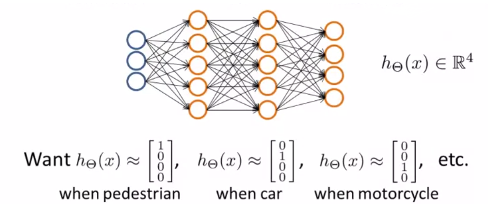

# TIL ( 2020/12/30 )

- Examples and Intuitions 2
- Multiclass classification

---

## Examples and Intuitions 2

이전 시간에 봤던거를 생각해보면 각 node에 가중치를 어떻게 주냐에 따라서 아래와 같이 AND, XNOR등 logic gate로 표현 할 수 있었다. 

보통 음의 값으로 크게 가중치를 주게 되면 해당 노드는 0의 값을 갖는다는것을 알고가자 이번에는 이런 원리를 가지고 hidden layer를 추가해서 아래와 같이 여러 logic gate를 사용해서 신경망을 만들수도 있다! 라는 정도로 알고 가자 참고로 +1은 bias

  

## Multi-class classification

신경망을 이용해서 multi-class를 분류하는 방법에 대해서 먼저 간단히 알아보자

multi-class classification문제를 신경망에 사용하기 위해서는 one-vs-all의 확장된 방법을 사용해야 한다. 위에 그림을 보고 설명하면 이미지를 인식한다고 했을때 주어진 이미지가 보행자인지 차인지 트럭인지 혹은 오토바이인지 분류하는 문제에서는 출력 레이어에 4개의 unit을 넣도록 구성하면 된다. 그렇게 출력이 되면 길이가 4인 벡터값이 나오게 되고 이 벡터값을 이용해 각각이 어떤것인지 구분한다.

>## Reference

- https://www.coursera.org/learn/machine-learning

