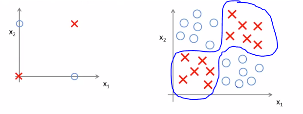
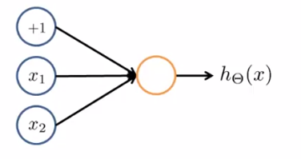

# TIL ( 2020/12/29 )

- Examples and Intuitions 1

---

이번 강의에서는 Non-linear function을 계산할 수 있는 간단한 예제를 살펴본다.

## Examples and Intuitions 1

- #### Non-linear classification example: XOR/XNOR

 과 같이 binary(0 or 1)한 task에서 아래와 같은 예제가 있을때 우리가 원하는것은 오른쪽과 같이 positive와 negative를 분류하는것인데 

XOR, XNOR를 통해서 신경망이 어떻게 이 작업을 수행하는지 살펴보면, y(label)을 계산하기위해 아래와 같이 식을 세워보면

  

XOR에서는 제대로 동작하지 않을것이고 XNOR에서는 서로 값이 동일해야 1이 되기때문에 더 적절한 방법이라는것을 예상 할 수 있다. 즉  이 둘다 positive거나 negative일때만 1이 반환되는것.

(간단히 예를 들은것 뿐이다.)

  

- #### Simple example: AND

3개의 node를 가진 network로 예를 보면, 

맨위에 bias node까지 표시를해서 각 node순서대로 -30,20,20의 값이 곱해져서 mapping된다고 가정한다. 좀 더 구체적으로 이전시간에 봤던 식을 통해서 나타내면 아래와 같다.

이제 AND gate를 사용해서 어떻게 계산되는지 자세히 살펴보자 (sigmoid에 주의)

-  = {0,0} : g(-30) hypothesis function는 0과 근접한 값을 갖는다.
-  = {0,1} : g(-10) hypothesis function는 0과 근접한 값을 갖는다.
-  = {1,0} : g(-10) hypothesis function는 0과 근접한 값을 갖는다.
-  = {1,1} : g(10) hypothesis function는 1과 근접한 값을 갖는다.

  

- #### Simple example: AND

AND예제에서 node에 -10,20,20으로 곱해지는 값을 바꾸면 OR gate와 같이 연산이 되는것도 볼수있다.

  

**오늘 본 것은 신경망의 단일 뉴련이 AND및 논리 함수를 계산하는데 어떻게 사용 될 수 있는지 이해하기 위한 공부였다.**

>## Reference

- https://www.coursera.org/learn/machine-learning

