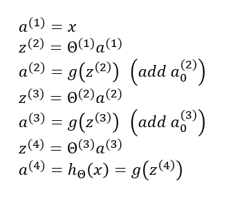
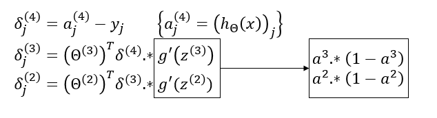

# TIL ( 2021/01/11 )

- Backpropagation Algorithm

---

이전 시간에 봤던 NN에서 사용하는 Cost function을 최소화 시키기 위해서는 매개변수  를 찾아야 하고 gradient descent나 다른 최적화 알고리즘을 사용해야 한다. 그래서 우리가 해야하는것은 매개변수  를 이용해서 를 계산하고 이것을 편미분해야한다.

## Backpropagation

먼저 하나의  training sample이 있는 경우 계산되는 과정을 살펴 보면 입력 x에 대한 출력을 계산하기 위해 Forward propagation을 시키게 된다. 

 

여기서  은 첫번째 layer의 input에 해당하고 차례대로  를 거치면서 sigmoid를 적용하고 bias를 더하는 과정을 이어가고 최종적으로 hypothesis 가 나오게된다. 이런 과정에 forward propagation이다. 

  

본론으로 돌아가 back propagation은 각 노드에 대해  을 구하는것인데 여기서 은 레이어를 뜻하고 는 해당 레이어의 노드에 에러가 있는지 나타낸다. 다시 정리해서  는 해당 node를 활성화 시키는것을 의미하는 반면에  는 활성화된 노드에 에러를 계산하는 것이다. Layer가 4개인 경우에는 아래와 같이 back propagation을 정의 할 수있다. 

 

위에 back propagation 식에서 input layer의 항이 없는 것을 볼 수 있는데 input layer는 training sample에 feature 값이기 때문에 에러값이 존재하지 않기 때문이다. 

## Backpropagation Algorithm

이제 하나의 training sample이 아닌 여러개의 training sample을 사용한다 했을때 Algorithm을 보면

- Set  := 0 for all(l,i,j)
- Set  (training sample t=1 to m)
- Perform forward propagation 
- Using  , Compute 
- Compute  using  
-  or with vectorization,  
- Hence we update our new  matrix.
  - 
  - 

- D matrix는 accumulator로서 우리가 구한 값들을 더하고 궁극적으로 편미분을 구하는 데 이용된다. 

>## Reference

- https://www.coursera.org/learn/machine-learning

