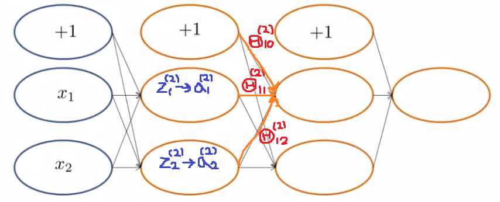
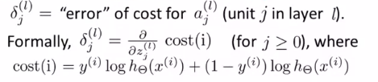
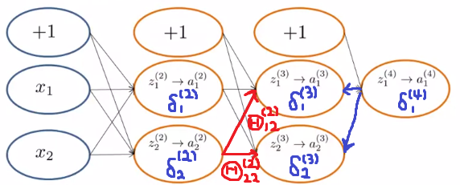

# TIL ( 2021/01/12 )

- Backpropagation Intuition

---

## Backpropagation Intuition

Backpropagation을 이해하기 위해서 2개의 hidden layer가 있는 network를 예로 Forward Propagation을 다시 보면

 

첫번째 hidden layer에서는 입력값에 의해서  과  가 계산된다. 이것은 가중치의 합계를 뜻하고 그 다음 activation function을 적용하면  와  를 구할수있다. 그럼 이 값에 각각의 가중치를 곱해주고 더해준뒤에 다시 두번째 hidden layer에 전달하여 똑같은 과정을 반복하여 최종 output 값을 얻어낼수있다. 

  

이제 실제 Backpropagation의 수행과정을 살펴보자 이전시간에도 말했듯 우리는 backpropagation을  로 표현하고 이것은 번째 layer에 unit 의 활성화 값에 대한 error로 생각할 수 있다.

  

그럼 위에 Forward Propagation의 예제를 다시 가져와서 Backpropagation을 하면 아래와 같은 그림으로 표현할 수 있는데, 

 

복잡하다고 생각할 수 있지만  를 예로 보자  는 어떻게 계산되는지 생각해보면 그 식은 이렇게 정의할 수 있다.  이것만으로 이해가 안될수 있으니 다른 예로  를 보자  는 마지막 output node와 하나만 연결된것을 볼 수 있는데 그럼 마지막 노드에  와 가중치  를 곱해주면   를 구할 수 있다. 

>## Reference

- https://www.coursera.org/learn/machine-learning

