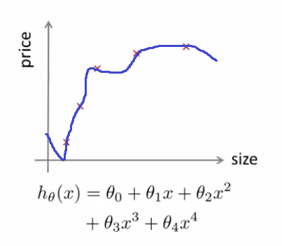

# TIL ( 2021/01/13 )

- Evaluating a Hypothesis
- Training/testing procedure for linear, logistic regression
- Model selection

---

기계 학습 진단 이라고 불리는 기술에 대해서 이야기 한다. 실행할 수 있는 테스트로 구현하는데 시간이 오래 걸릴수 있지만 학습 알고리즘을 개발할 때 유용하다.

## Evaluating a Hypothesis

 

기존에 이런 4차함수를 통해서 집의 가격을 예측하는 예제를 봤었는데 이 방법이 무조건 좋다고 할수 없는 이유가 하나는 overffiting에 대한 얘기였고 다른 하나는 traning set에 없는 새로운 data가 들어왔을때 제대로 일반화 시키지 못한다는것이었다. 그래서

 

이와 같은 dataset이 있다고 가정했을때 물론 더 많은 data가 있을수 있지만, 이런 문제를 해결하기 위해서는 모든 데이터를 training set으로 사용하지 않고 데이터를 training set과 test set으로 나누어서 성능을 평가한다. 

  

## Training/testing procedure for linear, logistic regression

  

#### Linear regression

- Learn parameter  from training data (minimizing training error )
- Comput test set error

 

#### Logistic regression

- Learn parameter  from training data
- Compute test set error

 

절차는 단순하고 같지만 1~3 주차에서 봤던 cost function을 계산하는법과 linear와  logistic의 차이점을 제대로 확인하자.

  

## Model Selection

모델을 선택하는 문제를 고려할때 데이터에 맞추기 위해서 다항식을 선택한다고 가정해보자 

 

우리는 여기서 임의에 n차수 다항식을 사용했을때 그 것을 적용하여 새로운  data에 일반화가 잘됐는지에 대한 추정값을 얻을수 있다. Test dataset을 이용하여 test error를 확인 했을때 5차항에서 가장 좋은 성능을 보였다면 이게 좋은것일까? 사실 이것은 extra parameter (degree of polynomial) 에 맞췄기 때문에 generalization error의 optimistic estimate이다.

 

그래서 data set을 training/validation/test 세개로 나누는 이유가 여기에 있다. 이렇게 나누게 되면 

 

각각에 대해서 error에 대한 수식으로 바뀌게 되고 다시 위에  를 결정하는 문제로 돌아가 보자 이제는  test set을 이용하는것이 아닌 cross validation set을 이용하여 풀면된다. 이렇게 cross validation set을 통해서 가장 성능이 좋은것을 찾아냈다면 generalization error는 test를 이용해서 계산하면된다. 

>## Reference

- https://www.coursera.org/learn/machine-learning

