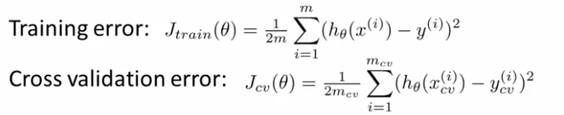
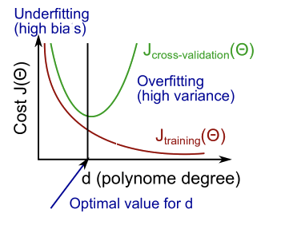

# TIL ( 2021/01/14 )

- Diagnosing Bias vs. Variance
- Regularization and bias/variance

---

Bias, 혹은 variance의 문제로 우리가 원하는 성능이 나오지 않거나 overffitng등의 문제에 직면 할 수 있다.  그래서 이번 강의에서는 이런 문제를 해결하기 위한 방법을 살펴본다. 

## Diagnosing bias vs. variance

 

위에 그림처럼 High bias의 경우 underfit할 수 있고 혹은 High variance의 경우 overfit이 발생 할 수 있다. 그럼 이 문제는 어떻게 해결할까 이전 시간에 dataset을 Training/Val/Test로 나눴던것을 다시 상기해보자 error의 관한식은 아래와같이 세울수 있다. 

 

먼저 Training error를 보자 일반적으로 차수가 증가함에 따라서 우리는 training set를 더 잘 맞출수 있을것이고 차수가 낮을수록 잘 맞추지 못할것이다. 이것을 x축은 polynomial로 y를 error한 그래프로 그리게 되면 아래와 같은 그림을 볼 수 있는데 일반적으로 이렇게 차수가 증가함에 따라서 training error가 감소한다는 것을 알 수 있다. 

다음으로 Cross validation error에서 보면 차수가 1이라고 했을때 간단한 기능을 갖고 있을것이고 그것은 underfit하기 때문에 error가 더 크게 발생 할 것이다. 그리고 어느정도 진행이 됐을때 적합한 차수에 근접할수 있을것이고 만약 차수가 더 커질경우 overfit이 발생 할것이다. 

 

이런 개념을 가지고 다시 생각해보자 우리가 어떤 알고리즘을 학습 시켰는데 기대하는것만큼 성능이 나오지 않는다고 가정 했을때 이 문제에서 high bias, variance문제를 갖고있는지 알수 있다. 위 그림에서 Cross validation error이 큰 부분을 보면 d가 낮을때 나타난 부분은 high bias을 뜻하고 높은부분은 high variance문제 즉, d(다항식)이 우리가 가지고 있는 dataset에 비해 너무 커서 발생하는 문제에 해당한다. 

그럼 이 두가지의 문제에서 우리가 알수 있는것은 underfit한 high bias에서는 training error와 validation error가 모두 높을것이라는것을 알수가 있고 overfit한 high variance문제에서는 training error는 잘 낮지만 반면에 validation error는 더 크다는 것을 알 수 있다.

  

## Regularization and bias/variance

Regularization을 통해서 overffing을 방지하는데 어떻게 도움이 되는지 알아본적이 있다. 그럼 Bias, Variance에 Regularization을 적용하면 어떻게 될까?

## Reference

- https://www.coursera.org/learn/machine-learning

