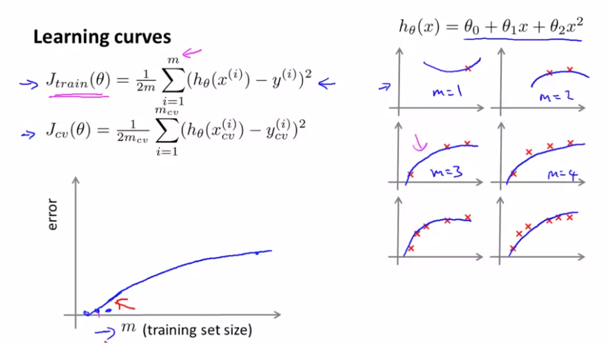
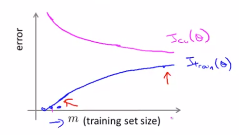
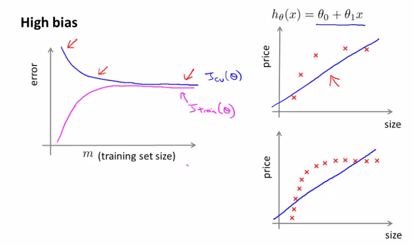
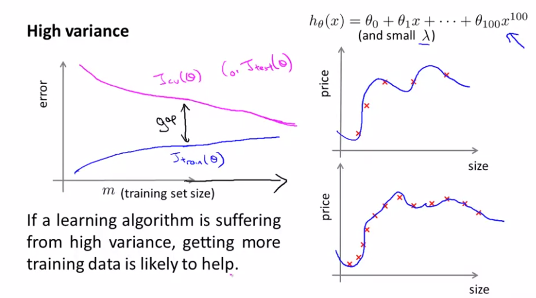

# TIL ( 2021/01/15 )

- Learning curves

---

Learning curve는 알고리즘이 올바르게 작동하는지 확인할 수 있는 좋은 도구라고 생각하면 된다. 

## Learning curves

먼저 m개의 dataset을 갖고 있다고 가정해보자 m=1일때는 당연히 error가 0에 가깝게 알고리즘은 정상적으로 작동할것이고 여기서 m을 점차 늘리게될경우 아래 그림과 같이 2차 함수로는 이 문제를 해결하기가 어려워지고 error또한 증가하게 된다.

 

하지만 이것을 Cross validation이나 test에 관점으로 봤을땐 dataset이 증가할 수록 새로운 예제에 대해서 잘 적응하기 때문에 train때와는 반대되는 error를 보여준다.

 

## High bias

그럼 High bias의 문제를 갖고 있을때 dataset의 개수에 따른 error는 어떤 성향을 나타내는지 보자 

  

1차 함수를 가정하고 dataset이 점차 증가했다고 했을때 당연히 이런 문제를 해결하기 어려울뿐만 아니라 learning curves를 그려보면 Cross validation과 Train의 error가 서로 가까워질 것이다. 

 

 이런 High bias에서 문제는 train이 끝나도 error값이 크다는점이다. 또한 여기서 알수있는 중요한것은 일반적으로 학습이 잘되지 않으면 training data가 부족하다고 생각하고 data를 수집하는데 시간낭비를 할 수 있지만 High bias가 어떤 Learning curve를 보여주는지 알고 있다면 training data를 더 추가하더라도 별반 차이가 없기때문에 시간낭비를 줄일수 있다. 

  

## High variance

이번에는 반대로 High variance문제를 갖고 있을때을 보자 

 

Train 과정에서는 잘 맞춘다고 error값의 증가폭이 낮을 수 있지만 사실 overfit하기 때문에 Cross validation erorr는 위와 같은 그림을 보이게 된다. 학습이 잘되고 있는지 High variance한 문제가 발생했는지 판단하는 방법은 train error와 validation error의 차이를 보면된다. 여기서는 High bias와는 다르게 dataset을 더 추가해준다면 train과 validation의 error는 점점 수렴하게 되고 실제로 알고리즘이 올바른 방향으로 가게 된다. 

  

- 정리를 해보면 Learning curve를 통해서 현재 알고리즘이 어떤 문제에 직면해 있는지 판단할수 있다면 dataset을 더 추가해야 하는지  아닌지의 여부를 판단할 수 있기때문에 시간낭비를 줄일수 있다(learning curve를 통해서 문제를 파악하는것 중요).

## Reference

- https://www.coursera.org/learn/machine-learning

