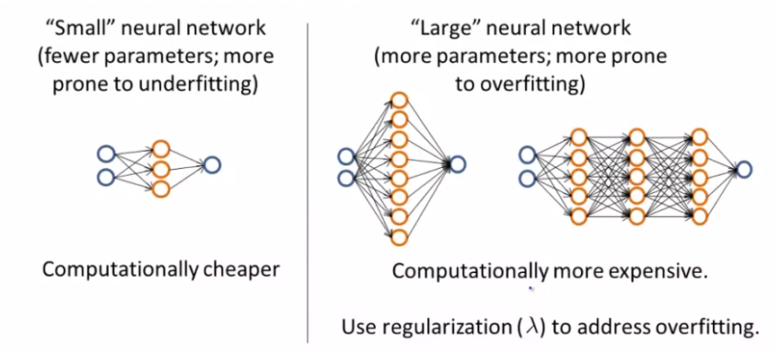

# TIL ( 2021/01/18 )

- Deciding what to do next revisited

---

## Deciding what to do next revisited

- Getting more training examples : Fixes high variance (이 부분에서 때로는 training example을 추가한다해도 잘 되지않을수 있다)
- Trying smaller sets of features : Fixes high variance
- Adding features : Fixes high bias
- Adding polynomial features : Fixes high bias
- Decreasing &lambda; : Fixes high bias.
- Increasing &lambda; : Fixes high variance.

이전 시간에 봤던것들을 Neural network와 관련시켜 보면,

 

왼쪽과 같이 작은 NN 의 경우 상대적으로 parameter가 적기 때문에 underfitting이 발생할 확률이 높다. 장점이라고 하자면 당연히 계산비용이 크지 않다는점이다. 

오른쪽과 같이 큰 NN의 경우는 hidden layer가 더 많기때문에 더 많은 parameter를 갖게 되고 따라서 overfitting이 발생할 확률이 높다. 당연히 NN가 커지기 때문에 계산 비용이 더 많이 들지만 overfitting의 경우 regularization을 통해서 어느정도 완화시킬수 있기때문에 작은 NN을 사용하는 것보다 더 좋은 방법일수 있다. 

  

#### Model Complexity Effects:

- Lower-order polynomials (low model complexity) have high bias and low variance. In this case, the model fits poorly consistently.
- Higher-order polynomials (high model complexity) fit the training data extremely well and the test data extremely poorly. These have low bias on the training data, but very high variance.
- In reality, we would want to choose a model somewhere in between, that can generalize well but also fits the data reasonably well.

## Reference

- https://www.coursera.org/learn/machine-learning

