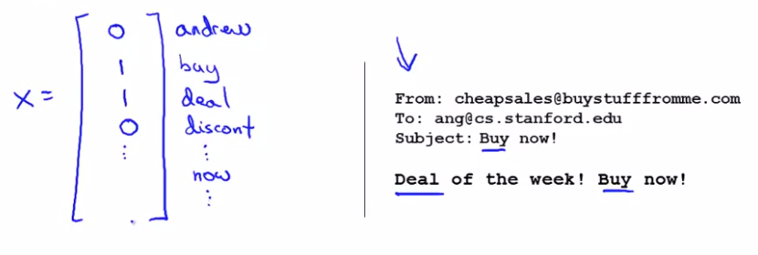

# TIL ( 2021/01/19 )

- Prioritizing what to work on : Spam classification example
- Error analysis

---

복잡한 Machine learning에서 발생할수 있는 주요 문제에 대해서 다룬다. 

## Building a spam classifier

Spam classifier를 만든다고 가정했을때, 

 

왼쪽은 Spam, 오른쪽은 Non-Spam의 예로 구분하기 위해서는 supervised learning을 이용하여 label은 1 또는 0 으로 분류한다. 

Supervised learning을 하기 위해서는 먼저 우리가 (feature of email)을 설정하고 =spam 1 or not spam (0)으로 label을 지정해줘야한다.  이메일에 대한 feature를 선택하는 방법은 예를들어 100개의 단어를 가지고 분류한다 했을때,

 

위와 같이 100 dimension을 가진 feature vector에 특정 단어가 나타나는지 여부에 따라서 1과 0을 넣어준다. 여기서는 수동으로 100개의 단어를 예제를 들었지만 실제로는 training example (10,000 to 50,000)의 단어를 선택하면된다. 

##### 그럼 여기서 적은 시간을 들여 더 높은 정확도를 갖도록 하기 위해서 어떤것을 해야할까?

흔히 생각 할수 있는 방법중 하나인 "많은 양의 데이터를 수집하는 방법"이 있을수 있지만 앞에서도 보았듯이 training dataset이 많다고 해서 항상 좋은 방법이 되진 않는다. Machine learning에서는 이외에도 다른 방법들이 많은데 Spam을 분류하는 방법에서는 email routing 의 정보를 이용하는 방법을 생각할수있다. 즉, 스팸 메일을 보낼때 단어에 집중하는것이 아니라 이메일의 가짜 header를 사용할수 있고 이외에도 spam mail에는 추측할수 있는 여러가지 요소들이 있는데 이것을 이용하는 것이다. Spam의 예로 조금 정리를 해보면 아래와 같은 방법들이 있다. 

- Collect lots of data (for example "honeypot" project but doesn't always work)
- Develop sophisticated features (for example: using email header data in spam emails)

- Develop algorithms to process your input in different ways (recognizing misspellings in spam).
- etc...

  

## Error analysis

 Machine learning에 문제가 발생했을때 이것을 해결하기 위한 간단한 절차는 아래와 같다.

- Start with a simple algorithm, implement it quickly, and test it early on your cross validation data.
- Plot learning curves to decide if more data, more features, etc. are likely to help.
- Manually examine the errors on examples in the cross validation set and try to spot a trend where most of the errors were made.

  

알고리즘의 EError analysis를 한다고 했을때 예를들어, 어떤 알고리즘에서 error가 높게 나오는데 Cross validation data가 500개 있다고 가정해보자 email을 분류하는 알고리즘인데 cross validation data중 100개가 오분류 됐다. 그럼 우리는 이 100개의 data를 수동으로 분석해서 이 알고리즘이 오분류를 하지 않게 어떤 기능이 추가되어야하는지 알 수 있을것이다. 

즉, data에서 문제를 찾아 그 문제를 해결 할수도 있고 혹은 기존의 spam을 분류하기 위한 방법들로 나온 방법들을 통해서 해결할수도 있을것이다.

## Reference

- https://www.coursera.org/learn/machine-learning

