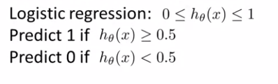
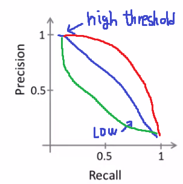
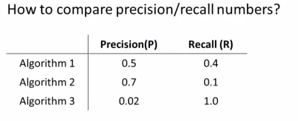
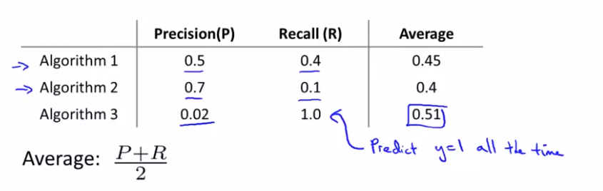
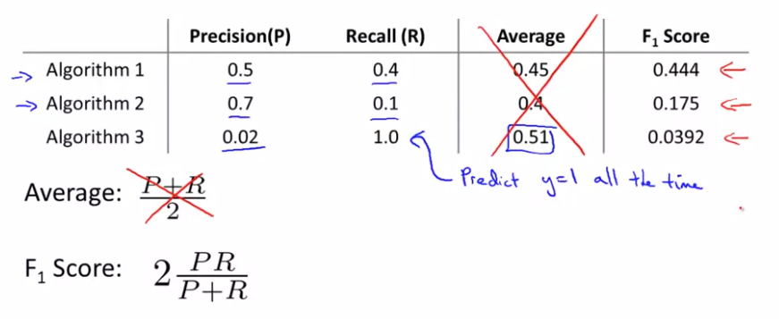

# TIL ( 2021/01/21 )

- Trading Off Precision and Recall

---

## Trading Off Precision and  Recall

Precision과 Recall은 서로 Trade-off 관계를 갖고 있는데 먼저 예를 통해서 알아보자,

 

위와 같이 Logistic regression을 통해서 0.5보다 작을경우 0을 출력하고 0.5이상일 경우 1을 출력한다고 가정했을때 우리는 좀 더 정확하게 예측하고 싶을때 임계값을 0.5가 아닌 0.7과 같이 더 높여서 좀 더 확실하게 분류를 할 수 있다. 이렇게 되면 Precision은 높아지고 Recall은 낮아지게 되는데 왜 그런지 detection에 관점에서 정리를 해보자.

   

  

  

##### 임계값이 클 경우 

- 임계값이 클 경우 Positive 감소, Negative 증가

- Precision의 False positive는 감소하기 때문에 Precision증가
- Recall의 False negative는 증가하기 때문에 Recall 감소 

  

##### 임계값이 작을 경우

- 임계값이 작을 경우 Positive 증가, Negative 감소
- Precision의 False positive는 증가하기 때문에 Precision감소
- Recall의 False negative는 감소하기 때문에 Recall 증가

  

이렇게 Precision과 Recall은 임계값에 따라서 서로 반비례 관계를 갖고 있고 그래프로 표현한다면 아래와 같이 그릴수 있다.

 

  

## F1 Score

그럼 우리가 3개의 서로 다른 알고리즘을 Precision과 Recall을 통해서 비교 한다고 했을때 어떤 알고리즘이 좋은지 결정을 할 수 있을까?

 

  

간단한 방법으로는 평균을 생각할수 있겠지만 이 방법은 좋지 않다.

 

 왜냐하면 Precision과 Recall은 trade-off인데 위에 예를 보면 Recall이 1이고 Precision은 0.02지만 평균값이 가장 큰것을 볼 수 있다.

  

##### F1 Score

그래서 F1 score라는것을 이용 하게 되는데 예제에 적용하게 되면 아래와 같은 결과를 얻을 수 있다.

 

F1 score는 얼핏보면 평균을 취하는것과 비슷하지만 분자를 보면 Precision과 Recall 둘 중 하나라도 0에 가깝거나 0일경우 F1 Score는 낮아지기 때문에 더 정확한 평가를 내릴 수 있다. 

  

## Reference

- https://www.coursera.org/learn/machine-learning

