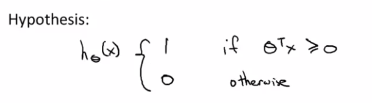

# TIL ( 2021/01/22 )

- Optimization objective

---

## Optimization objective

앞에서 다양한 학습 알고리즘을 공부했지만 사실 많은 지도 학습 알고리즘의 성능은 비슷하다. 어떤 학습 알고리즘을 사용하는것이 중요한게 아니라 데이터의 양이라던지 feature를 설계하고 정규화 파라미터를 선택하는 스킬들이 중요하다. SVM(Support Vector Machine)이라는 알고리즘이 있는데 이 SVM은 logistic regression 이나 NN와 비교해 보면 복잡한 비선형 함수를 학습하는데 큰 도움을 주는 알고리즘이다.

  

SVM은 logistic regression에서부터 시작한다.

 

logistic regression을 다시 생각해보면  일 경우  이 될것이고,   일 경우  이 될것이다.

  

이런 특징을 갖는 logistic regression의 cost function을 보면 아래와 같은데,

 

  

 인 경우와  인 경우를 살펴보자 1일 경우에 두번째 항은 0이 되기때문에 첫 번째 항이 의미가 있고 0일 경우에 두번째 항이 의미를 갖는데 이것을 Z에 관한 함수로 도식화하면 아래와 같은 그래프로 나타낼수가 있다. 

 

  인 그래프를 보면 Z가 클 때 cost function이 작아지는것을 볼 수 있는데 이러한 이유 때문에 Positive 에서 Z의 값을 크게 설정하려고 하는것이다. 인 경우에는 1과 반대가 된다고 생각하면된다.

  

우리는 support vector machine을 이해하기 위해서 먼저  일때 cost function에 z부분을 z=1일때를 기준으로 새로운 cost function을 그리고  일때는 z=-1을 기준으로 새로운 cost function을 그린다.

 

이렇게 되면 z=1을 기준으로 오른쪽은 0은 수평이되고, 왼쪽영역은 logistic regression과 유사하지만 직선의 형태를 띄게 된다. 기존과 차이점이라고 하면 단지 두개의 선분으로 나뉜다는것 밖에 없다. 이 과정이 무슨 의미를 갖는지 의아하겠지만 이 방법을 통해서 우리는 support vector machine이 더 편하게 계산하도록 해줄수 있고 최적화 문제를 더 쉽게 해결 할 수 있게된다.

  

## Support vector machine

위에서 새로 정의한 cost function을 각각 Cost1(), Cost0()이라고 새롭게 정의하고 이것을 Support vector machine으로 표현하게 되면 아래와 같다.

 

하지만,  1/m과 m은 상수로 곱하던 나누던 &theta;의 최소값은 동일하기 때문에 1/m과 m을 제거한다. 그리고 정규화를 위해서 추가된 항에 &lambda; 를 제거하고  를 1/m을 제거한 자리에 넣어 줌으로써 &lambda;값에 따라서 두번째 정규화 항의 가중치가 변하는것이 아니라 앞에 항을 조절해주는것이다. 즉, 여기서 C를 아주 작은 값으로 설정하면 맨 뒤에 항이 훨씬 더 큰 비율을 제공하게 되는것이다. 그럼 최종적으로 Support vector machine의 식은 아래와 같다.

 

  

SVM은 logistic regression과 다르게 확률을 출력값으로 하지 않고 

 

위와 같이 SVM이 예측하는것은  y=1 or 0 이고 parameter &theta;를 학습하는 SVM은 그냥 하나의 형태이고 수학적인 정의이다.

  

## Reference

- https://www.coursera.org/learn/machine-learning

