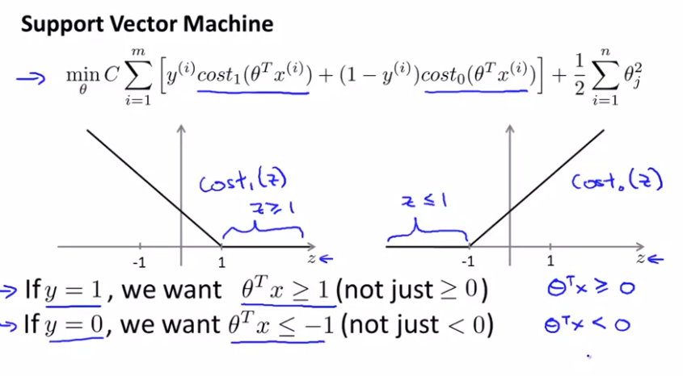
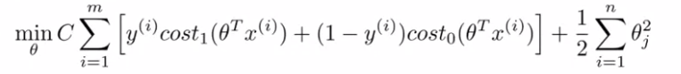
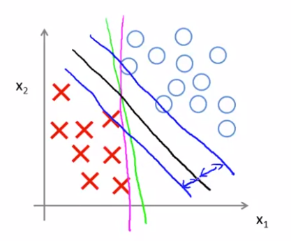
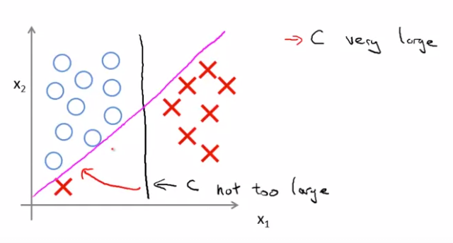

# TIL ( 2021/01/28 )

- Large Margin Intuition

---

## Large Margin Intuition

SVM은 큰 마진을 가진 분류기인데 이번 강의에서는 SVM의 hypothesis가 무엇인지와 모양을 설명한다.

  

 

(Positive sample) 일때와 (Negative sample) 일때 Cost function을 도식화 한 그림이다. 를 뜻하는데 Positive sample의 Cost(z)가 0이 되는 지점은 이고 , Negative sample의 Cost(z)가 0이 되는 지점은  의 조건이 성립할 때이다.

  

Logistic regression에서 생각해보면 일 때 (Positive sample) 이었고 반대로 0보다 작을때는 (Negative sample) 을 예측했지만 SVM에서는 추가적인 Safety factor나 Safety margin factor를 구축하기 때문에 좀 더 다른 의미를 갖는다.

  

 

SVM의 Cost function을 다시 보자 C의 값이 매우 큰 값을 갖는다고 하면 최적화를 시키기 위해서 첫번째 항은 0을 갖게 될 것이고 우리에게 남는 항은 두 번째 항인 정규화 항이 남게된다. 여기서 최적화 문제를 풀 때 파라미터 의 함수로 최소화를 하게 되면 아래와 같이 Decision Boundary를 얻을수 있다. 

  

 

그림과 같이 positive와 negative sample이 있다고 했을때 sample들을 분류하는 직선을 그릴 수 있고 분홍색과 녹색은 간신히 구분하기 때문에 좋아보이지 않는다. 그래서 SVM은 검은색과 같은 decision boundary를 선택을하고 그림과 같이 두 개의 파란색(margin)을 갖는다. 이런 마진은 SVM의 특징인데 SVM이 큰 마진 분류기라고 불리는 이유가 가능한 큰 마진으로 데이터를 분리하기 때문이다. (자세한 설명은 하지 않았고 다음 강의에서 더 깊게 얘기함)

  

 

또한, 위 그림과 같이 Positive sample속에 Negative가 섞여있거나 하더라도 SVM은 C가 그렇게 크지 않은 경우 어느정도의 outlier data는 무시한다.

  

다음 강의에서 수학적으로 접근해서 더 자세히 알아본다.

## Reference

- https://www.coursera.org/learn/machine-learning

