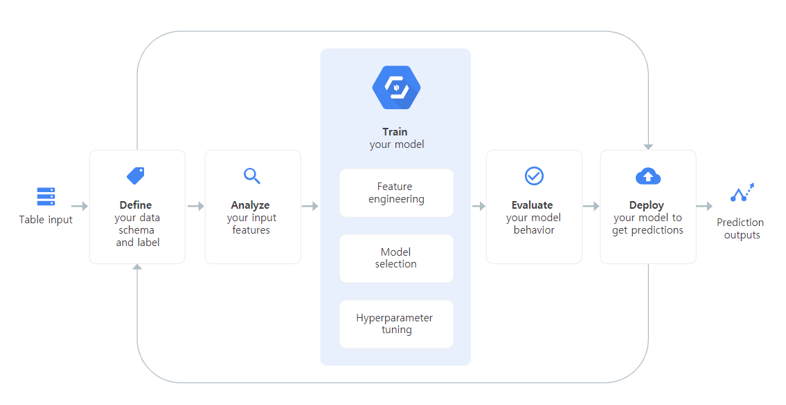
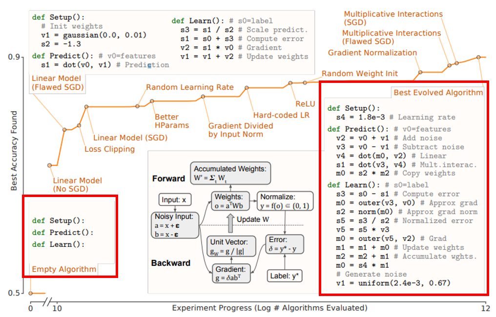
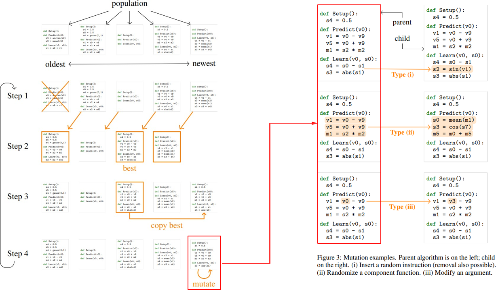
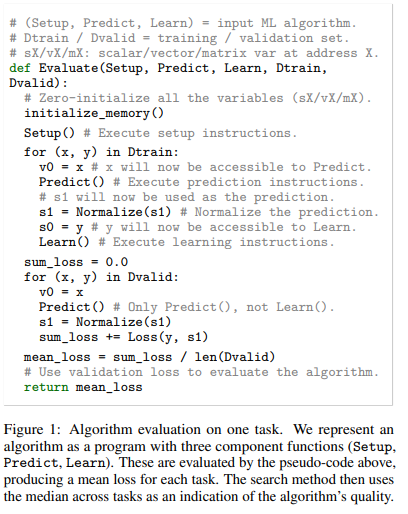

# TIL ( 2020/11/18 )

- AutoML-Zero: Evolving Machine Learning Algorithms From Scratch

---

AutoML-Zero는 google에서 발표한 논문으로 시작은 Empty algorithm으로 시작해서 컴퓨터가 모델의 성능을 점점 진화시켜 나가면서 끝에는 성능이 괜찮은 알고리즘을 자동으로 얻어낼수 있는것이 AutoML-Zero의 전반적인 내용이다.

## Introduction

지금까지 머신러닝이나 딥러닝에서 성능이 좋은 모델을 만들어내기 위해 모델의 구조, 최적화 방법, 학습 방법등 굉장히 많은 다양한 연구를 해왔고 크게 발전해왔다. 하지만 이러한 부분에서 사람이 직접관여하는 모델 설계나 파라미터를 설정하는데 시간을 쓰는 대신 컴퓨터 계산을 통해서 대신 model에 architecture나 hyperparameter를 찾아주는 AutoML이라는 분야가 있다. 원래는 사람이 다 설계를 해왔다면 어느정도는 컴퓨터가 최적화 시킬수 있다는것을 아래 그림과 같이 볼수 있고 지금까지 AutoML이 최적화한 큰 분야는 모델의 구조, hyperparameter, Learning rule등이 있습니다. 

#### Constrained Search Space

AutoML중에서 architecture search에서는 지금 까지 사람이 제한을 걸어놓고 그 안에서 search를 하면서 최적화된 모델을 결과로 만들어네는 방식이었는데 본 논문에서는 search space에 대한 제한을 뒀을때 그에 따라 컴퓨터가 search를 하는데 있어서 치우쳐진 NAS결과가 나타나게 되고 serach space 제한을 정의하는데 사람과 전문성, 시간이 너무 많이 요구 되기때문에 사람과 기존의 NAS의 목적에서 멀어지고있다고 얘기를 하고있다. 

#### Propose

그래서 간단한 수학적 연산을 building block으로 해서 처음부터 끝까지 한번 머신러닝 모델을 search하는것으로 약간에 제한을 준다. 여기서 사용되는 building block은 64개의 연산으로 덧셈, 뺄셈, 곱셈, 나눗셈등과 같이 간단한 연산부터 삼각함수, 가우시안등 다양한 연산들이 포함되어있다. 머신러닝 분야에서 많이 사용되는 matrix decomposition이나 derivative같은 포함시킬 경우 architecture search를 하면서 그 연산쪽으로 선택이 집중 될까봐 연산을 뺐다고 한다.

위에 그림과 같이 최소한에 Setup, Predict, Learn 세 개의 함수를 정의하고 이 안에 들어가는 연산들을 search하게된다. 처음에는 백지상태에서 최종 알고리즘은 연산들이 들어가있는 어느정도 완성된 알고리즘까지 만들어 내겠다는것이 본 논문에 목적이고 저자들은 5일동안 많은 cpu precess를 이용해 이 알고리즘을 만들어 냈다. 

## Method

본 논문에서는 Evolutionary method를 이용한 탐색을 했다. 처음에는 population=5,  선택하는 T=3이라고 가정하고 알고리즘을 보면 왼쪽 그림과 같이 5개의 population이 주어졌을때 가장 왼쪽이 oldest, 오른쪽이 newest로 step1에서는 가장 오래된 모델을 지우고 나머지 네개중에서 T만큼 랜덤으로 선택을 한다. 그럼 step2 그림과 같이 색칠된 박스가 선택이 되고 성능을 검사해서 그 중 가장 성능이 좋게 나온 모델을 step3과 같이 선택하고 복사본을 만든다. 이 복사본을 mutate를 돌리는데 여기서 중요한것은 기존에 mutate는 step을 돌면서 평가를 하고 계속 muate를 돌면서 최선에 알고리즘을 찾을때까지 반복을 하는데 저자는 하나만 추가하는 방식으로 구현했다. 

오른쪽 그림을 보면 크게 3가지로 나눈것을 볼수있다. 첫번째는 랜덤으로 연산을 삽입하거나 삭제하는 연산으로 계속해서 추가하게 되면 너무 커지기때문에 삭제 확률을 두배로 정의해서 조절을 했다. 두번째는 랜덤으로 하나의 함수를 결정하고 함수에 들어가있는 연산을 다 교체해버리는 연산이다. 마지막은 하나의 argument만 교체하는 작은 mutate를 가해주는 연산으로 예를들어 Setup함수에 s4=0.5를 바꾸는 경우 0.5~2.0사이의 수를 랜덤으로 선택하고 여기에 곱셈을해서 10% 확률로 부호를 방법을 사용했다고 한다. 

#### Search Space

Step3에서 best algorithm을 찾는 과정이있는데 best algorithm을 찾는 방법은 아래와 같다.

Setpu함수는 initialization하는 부분으로 보면되고 여기서 train과 validation dataset이 추가로 evaluation 함수로 들어가게되고 그럼 train을 통해 모델을 학습시키고 그 모델의 Predict함수와 learn함수를 통해서 학습을 시키고 validation을 해서 최종적으로 각 알고리즘의 성능을 나타내게 된다. 좀 다른 부분은 저자는 결과값이 binary classification일 경우 0 or 1, multi classification일 경우 class의 개수만큼 정수로 반환하는 부분으로 따로 추가시켰다. 

>## Reference

- https://cloud.google.com/automl-tables/?hl=ko
- https://www.youtube.com/watch?v=J__uJ79m01Q

