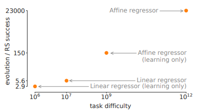
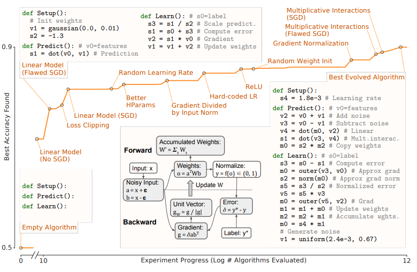
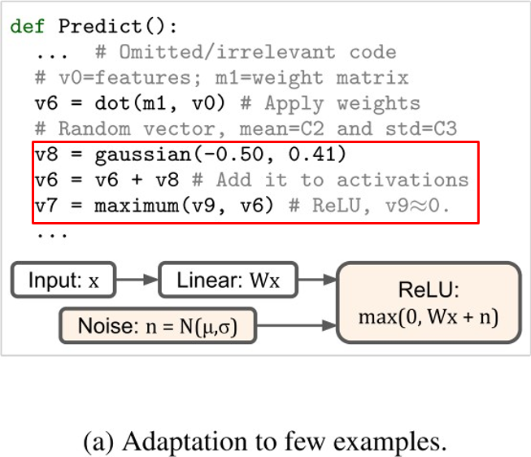
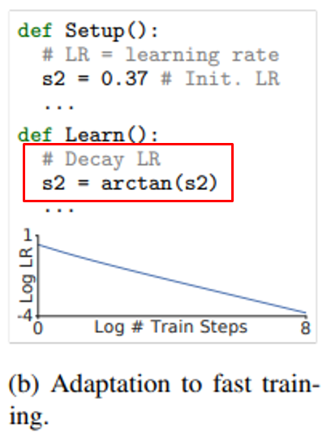
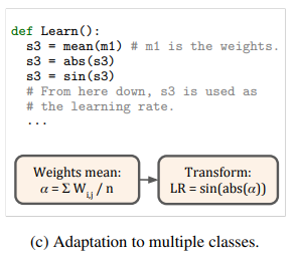

# TIL ( 2020/11/19 )

- AutoML-Zero: Evolving Machine Learning Algorithms From Scratch

---

## Experimental Results

  

위 그림은 AutoML-Zero와 똑같은 building block을 사용해서 random search로 모델을 만들어보고 성능을 나타낸것으로  y축은 random search success rate와 AutoML-Zero success rate를 비교한것이고 x축은 각 task의 난이도를 뜻한다. task의 난이도가 상승할수록 random search와 AutoML-Zero에 성능의 차이가 극명하게 나타나는 것을 볼수있다. 여기서 y축은 hand designed reference model에 비해 더 좋거나 같은 성능을 보이는경우를 나타내는 acceptable algorithms이 나올 확률이 얼마나 되는지를 기준으로한다. x축의 task difficulty는 random search algorithm이 1개 acceptable algorithms을 찾는 동안 얼마나 많은 알고리즘을 평가해서 1개를 찾았는지 확인하고 그것에 로그값을 취한것이다.

  

  #### Dataset & Experimental conditions

  

저자들이 search가 계속됨에 따라서 알고리즘의 성능이 좋아지는 지점을 체크를해서 그린것으로 위의 그림은 실험에 대한 illustration이다. 실제 정량적인 평가를 할때는 실험을 5번 반복한다던지 20번을 반복해서 결과적으로 나온 모델의 성능을 평균을 내는 식으로 했다고 한다. AutoML-Zero는 CIFAR-10의 최종 task가 binary classification이라면 CIFAR-10과 MNIST의 task를 추출해서 이것을 두개만 구분하는 binary classification으로 간소화 시켰다. 이렇게 되면 가능한 경우의 수는 10c2로 45pair가 가능하다 각 pair를 8000개의 train과 2000개의 validation으로 나누고 45개중 36쌍은 best algorithm을 찾는 T_search라는 데이터셋으로 사용했고 나머지 9쌍은 최종적으로 이 실험에서 가장 좋게나온 모델을 가져와서 그 모델중에서 best accuracy가 무엇인지 정량적 평가하는 T_select로 사용했다. CIFAR-10의 test dataset은 final evaluation을 위해 남겨둔다. operation에 약간에 제약이 들어가게 되는데 setup/predict/learn에 각각 7/58/58로 제한을 뒀고 Max로 21/21/45로 제한을 두었다. 다시 정리 하면 아래와 같다. 

  

- CIFAR-10과 MNIST에서 task를 추출해서 binary classification으로 간소화
- 10C2 (45pair)로 각 pair를 8000 train/ 2000 valid example로 나눔
- 36 pair는 search task에 이용하는 T_search
- 9 pair는 best accuracy를 찾는데 이용하는 T_select
- CIFAR-10 test set은 evaluation을 위해 남김
- Operation constraint : 7/56/56 (Setup/Predict/Learn)
- maximum num : 21/21/45(Setup/Predict/Learn)
- Training Epoch : 1 or 10
- Evolution parameter : P = 100, T = 10

  

#### Comparison with other methods

- Best model의 parameter를 random search를 이용해 최적화 시키고 비교 방법인 linear/nonlinear baseline로 동일한 횟수 동일한 방법으로 최적화 한다.
- CIFAR-10으로 최종 모델의 성능 비교
  - Propose method : **84.06%**(+-0.1%)
  - Linear baseline : logistic regression, **77.65%**(+-0.22%)
  - Nonlinear baseline : 2-layer fully connected neural network, **82.22%**(+-0.17%)

- 이외 다양한 성능 결과 비교
  - SVHM(32x32x3) : **AutoML-Zero(88.12%)** , Linear baseline(59.58%), Nonlinear baseline(85.14%)
  - Down-sampled ImageNet(128x128x3) : **AutoML-Zero(80.78%)** , Linear baseline(76.44%), Nonlinear baseline(78.44%)
  - Fashion MNIST(28x28x1) : **AutoML-Zero(98.60%)** , Linear baseline(97.90%), Nonlinear baseline(98.21%)

  

#### Challenging task

  

- ##### Few training examples

Training dataset = 80, epoch = 100으로 적은량의 데이터셋을 가지고 실험했을때 위에 그림과 같이 AutoML-Zero가 input gaussian noise를 더해서 그것을 ReLU를 취하는 Noisy ReLU를 구현한것을 볼수 있다. 저자들은 Training dataset을 80개와 800개로 재실험을 했을때 80개를 가지고 학습 했을때 더 많은 경우에서 Noisy ReLU가 구현된것을 확인했다.

  

- ##### Fast training

두번째로는 training을 빨리 해야하는 상황이 주어졌을때 인데 Training dataset=800, epoch=10을 주고 진행을했다 그 결과 AutoML-Zero가 learning-rate decay를 알아서 구현했고 epoch를 10 과 100을 주고 재실험을 했는데 epoch=10일때는 모두 learning-rate decay를 스스로 구현했고 epoch=100일때는 드물게 구현이 됐다고 한다.

  

- ##### Multiple classes

마지막으로 이전까지는 두개의 class만 맞추는 경우였다면 multiple class를 적용시킨 결과이다. CIFAR-10의 10개의 클래스를 모두 학습했을때 위와 같이 알수 없는 연산이 발생했고 multi, binary 각각 30번씩 재실험을 한 결과 binary class에서는 한번도 나타나지 않았지만 multi class에서는 24번이 나타났다고 한다.

  

## Conclusion

AutoML-Zero는 scratch부터 시작해서 기본 수학 연산을 조합해서 gradient descent, normalized gradients등으로 발전시켜 좋은 성능의 모델을 만들어 냈다. 하지만 AutoML-Zero가 만들어낸 알고리즘을 해석하는데 시간이 오래 걸린다는 문제가 있어 이 부분에 대한 추가적인 연구가 필요하다고 한다. 결론적으로 AutoML의 목표는 인간의 개입을 최소화 하며 머신러닝 알고리즘을 자동으로 검색하는 것이었고 실험결과를 통해서 어느정도 자신들의 목표에 가까운 방법을 제안했다. (신기하다)

>## Reference

- https://cloud.google.com/automl-tables/?hl=ko
- https://www.youtube.com/watch?v=J__uJ79m01Q

