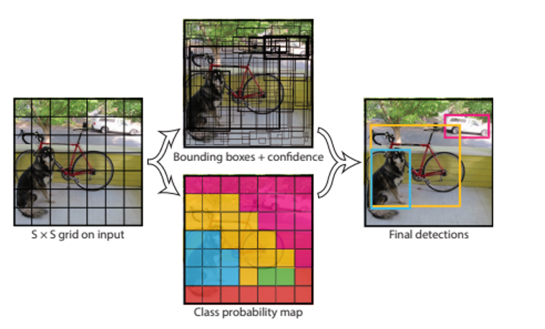
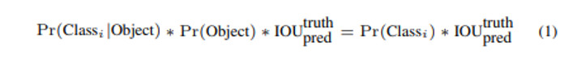
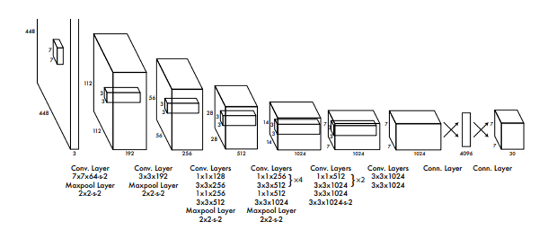
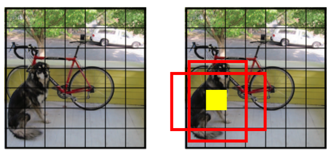
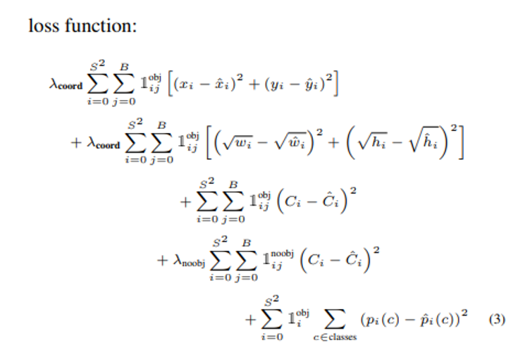

# TIL ( 2020/11/05 )

- You only look once : Unified, real-time object detection

---

기존에 detection은 sliding window 방식을 이용한 Deformable parts model(DPM)을 사용했다. 즉, 많이 봐서 평가하는 방식이었지만 해당 논문에서는 한번만 보고 detection문제를 Single Regression problem으로 접근 하겠다 하는 방법이다.

##### Unified Detection

모든 바운딩 박스랑 클래스에 대해서 한번만 고려를 하는데 처음에는 그리드 – 그리드 셀 – class probabilites를 구하는 세단계로 나누어져있다

먼저 이미지를 SxS에 그리드로 나누고 그 그리드안에서 바운딩 박스를 친다음 confidence score를 계산한다. 얼마나 물체가 포함되어 있는지를 확인하고 그 클래스 개수에 맞춰서 class probability를 한다. 

전체적인 archtecture는 위와 같은 모습을 보여주고 최종적으로 나오는 7x7x30를 detection에 사용한다.

예를들어 아래와 같은 이미지가 있다고 했을 때 특정 셀에대한 class probability를 했기 때문에 아래 노란색 그리드 셀은 강아지에 대해서 계산을 하게 되는데 해당 셀을 중심으로 바운딩 박스를 2개를 예측하고 계산을 거쳐서 confidence score가 더 높은 박스를 선택하게 된다. 하지만 문제는 해당 논문에도 나와있듯이 해당 셀에 두개의 class가 잡힐경우 잘안된다고한다.

##### Loss function

해당 방법에서는 regression model 을 이용하기 때문에 SSE를 써서 좀더 단순화 시켰다. 또한 셀기준으로 classification을 하기 때문에 해당 loss보다 bounding box loss에 가중치를 더 크게 가져가는것을 볼 수 있다. 