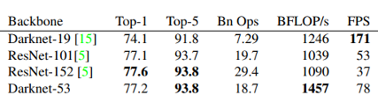

# TIL ( 2020/11/08 )

- YOLOv3

---

#### Yolov3: An Incremental Improvement

 

YoloV3는 이전 버전에 비해서 더 커졌지만 정확도는 향상된 모델이다.

 

##### Bounding Box Prediction

YoloV2에서 anchor box가 엉뚱한 곳으로 가지않게 sigmoid를 사용한 것처럼 많이 바뀐 부분은 없다. 좀 특이한 부분이 있다면 YOLOv3는 각각에 GT에 대해서 bbox가 하나만 assign된다. 

 

##### Class Prediction 

Detection은 regression과 classification을 둘다 해야하는 multitask 문제인데 classification쪽에서 multi label을 하기 위해서 여러 클래스에 대해서 각각 sigmoid를 적용해서 binary classification으로 바꿔서 구성을 했다. 

 

##### Predictions Across Scales

미리 predict된 box를 3개의 scale에 대해서 3개에 anchor box를 사용하게 된다. 그래서 NxN 이 있을때 N * N * (3(box) * (4(coordinate)+1(score)+80(coco class))가 된다. 

 

##### Anchor Boxes

YOLO는 가지고있는 training set을 분석을 해서 k-means clustering을 적용해 bounding box 을 정의한다. 이 방법이 유용한 이유는 만약에 pedestrian class를 찾는다고 했을 때 대부분 세로로 긴 box를 갖기 때문에 가로로긴 box를 많이 사용할 필요가 없다. 이처럼 내가 찾고자 하는 객체에 특징을 분석해서 anchor box를 정하는 것이 좋은 방법이다. 

 

그 동안에 v1, v2와 bounding box에 개수를 보면 v1=98개, v2=845개 v3=10,647개로 v2에 비해서 10배이상으로 box의 개수가 증가한 것을 볼수있다. 

 

 

 

##### Feature Extraction

기존 Darknet-19보다 속도는 느리지만 ResNet과 비교했을 때 여전히 높은 속도를 보여주고있고 또한 ResNet-101, 152와 비교에서 layer가 적기 때문에 같은 연산량에서 BFLOP(연산속도)가 뛰어난 것을 볼 수가 있다. 이 부분이 중요한 이유는 detection에서 실시간성을 강조하는 경우가 많은데

 

##### Architecture

Architecture는 feature map size가 점점 줄어들고 끝나지 않고 다시 거꾸로 upsampling 하면서high level feature를 뽑고 downsampling됐던 과정에서 위치 정보를 뽑아서 덧셈을 하는 Feature Pyramid Network랑 거의 유사한 구조를 사용하고있다. 

 

##### Training

Full image를 전체를 사용했고 objectness score로 thresholding을 해서 물체가 없는 것은 그냥 날려버리기 때문에 negative mining방법을 사용하지 않았다는것이 독특한점이다. 여기서 negative mining은 물체가 없는쪽에 box가 쳐지기 때문에 classifiaction을 할때 보통 background라는 class를 넣는 방법이다.

 