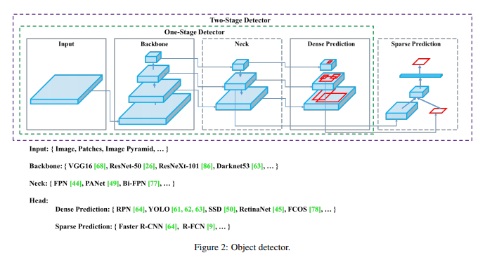
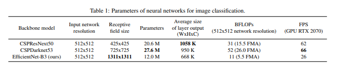
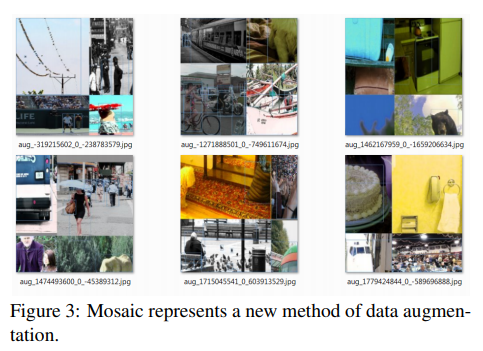
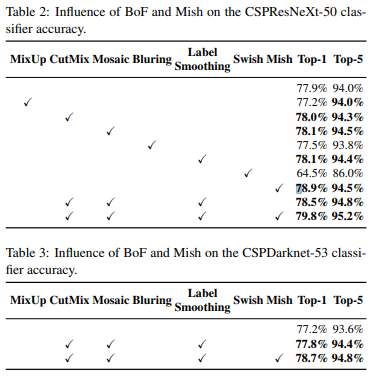

# TIL ( 2020/11/10 )

- YOLOv4 : Optimal Speed and Accuracy of Object Detection

---

Object detection에 경우 R-CNN이후 활발히 연구가 진행되었다. 실생활에서 실시간성이 필수가 아닌 곳 에서는 종종 사용하지만 실제로 적용되는 사례가 적은데 그 이유가 “실시간”이다. 그래서 YOLO에 저자들은 빠르면서 정확한 detector를 연구해야한다는 것을 강조하고있다. Main contribution은 sota method 방법들을 바탕으로 정확도를 높였고 single GPU만을 사용해도 가능하게 만들었다.  

## Introduction

  

저자는 Detection에 관련된 연구들을 보기 쉽게 위와 같은 그림으로 정리를 해놓았다. Head를 보면 1-stage, 2-stage를 나누는데 한번에 Dense prediction을 하는 것이 1-stage이고 Dense prediction을 하고 한번 더 Sparse prediction하는 것이 2-stage이다. 단순히 다양한 연구들이 진행되어온 것을 정리해준 그림이고 YOLOv4에서 사용한 기술들은 아래에서 설명합니다.  

  

## Bag of freebies(전처리, 학습단계)

YOLOv4의 저자들은 Bag of Freebies단계에서 아래와같은 방법들로 실험을 진행했다. 물론 다 좋은 결과를 보여준것은 아니고 실험을 통해서 좋은 결과를 보여주는 방법을 찾아냈다.  

  

#### Data Augmentation

- Random erase : Input data에 임의에 영역에 box를 주고 해당 영역을 0~255값으로 random하게 바꿔주는 방법

- CutOut : Random erase가 0~255였다면 CutOut은 0의값을 넣는 방법

- MixUp : 두 이미지랑 라벨을 alpha blending하는 방법

- CutMix : CutOut + MixUp

- Style transfer GAN

 

#### Regularization

- DropOut : 네트워크의 일부를 랜덤하게 생략하는 방법

- DropPath : 고정된 확률로 셀의 각 경로를 확률적으로 제거하는 방법

- Spatial DropOut

- DropBlock : Feature의 일정 범위를 함께 생략하는 방법

 

#### Loss Function

MSE, IoU, Generalized IoU, Complete IoU, Distance IoU

  

  

## Bag of specials(architecture related)

#### Enhancement of receptive filed           

- Spatial Pyramid Pooling
- ASPP(dilated conv)
- Receptive Field Block(RFB)

 

#### Feature Integration

- Skip-connection
- Feature Pyramid Network
- SFAM(Scale-wise Feature Aggregation Module)
- ASFF(adaptively spatial feature fusion)
- BiFPN

 

#### Activation Function

- ReLU
- Leaky ReLU
- Parametric ReLU
- ReLU6
- Swish
- Mish

 

#### Attention Module

- Squeeze-and-Excitation
- Spatial Attention Module

 

#### Normalization

- Batch Norm
- Cross-GPU Batch Norm
- Filter Response Normalization
- Cross-Iteration Batch Norm

 

#### Post Processing

- NMS
- Soft NMS
- DIoU NMS

  

## YOLOv4

YOLOv4는 위와 같이 정말… 엄청나게 많은 실험을 진행했다. Backbone을 결정할때는 세가지 조건을 고려했는데 첫번째로는 YOLO에 고질적인 문제인 작은 객체에 대해서 취약하다는 점이었는데 다양한 객체를 잘 찾기 위해서 input resolution(512x512)을 크게 가져갔고 receptive filed를 많이 가져가기 위해서 많은 layer층을 쌓았다. 또한 하나의 이미지에서 여러 크기의 객체를 찾기위해서 parameter의 수를 증가시켰다.  

  

위의 그림을 보면 CSPDarknet53의 경우 parameter의 수가 EfficientNet-B3보다 많고 FLOP도 가장 많은데 FPS가 가장 빠른 것을 볼 수 가있다. 이렇게 속도가 빠른 이유는 CSPNet에서 input feature map을 두개로 나눠서 하나는 아무런 연산을 하지 않고 나머지는 연산을 한 뒤에 이 둘을 concat을 해주는 방식인 Cross stage Partial Network 사용하는데 이 방식을 Darnet53에 사용해서 정확도는 거의 손실되지않고 속도를 높일 수 있다고 한다.  

YOLOv4에 전체적인 구조는 CSPDarkNet53(Backbone) + SPP + PAN(Path Aggregation Network) + BoF +BoS + YOLOv3(Dense Prediction) 이다.  

## Selection of BoF and BoS

실질적으로 YOLOv4에서 사용한것들을 정리해보면 아래와 같다,  

- Activation : ReLU, leaky-ReLU, Swish, or Mish
- Bounding box regression loss : MSE, IoU, GIoU, CIoU, DIoU
- Data augmentation : CutOut, MixUp, CutMix
- Regularization method : DropBlock
- Normalization : Batch Normalization, Filter Response Normalization, Cross-Iteration Batch Normalization
- Skip-connection : Residual, weighted residual, Multi-input weighted residual, Cross stage partial

  

  

## Additional improvements

여기에 자체적으로 제안한 방법들이 있는데 4개의 이미지를 위와 같이 하나의 이미지로 합쳐주는 mosaic augmentation방법으로 이런 이미지를 사용 할 경우 한 개의 input으로 4개의 image를 학습하는 효과가 있기 때문에 batch size가 4배가 되는 효과가 있다. 그 다음으로는 Self-Adversarial Training(SAT)를 제안했다(내용이 자세하지 않다).  

  

## Experimental, Conclusion

아래에 결과를 보면 모든 방법이 좋은 성능은 못보 였지만 특정 방법을 사용했을 때 성능이 올라간 것을 볼 수 가있다. 이 외에도 논문을 보면 많은 실험 결과들을 볼 수 있으니 참고하면 좋을 것 같다. 

  

YOLOv4는 다양한 기법을 적용해봄으로써 빠르고 정확한 detector를 만들어냈고 Single GPU환경에서도 training을 할 수 있게 만들어주었다.  

  

  

>## Reference

- https://hoya012.github.io/blog/yolov4/