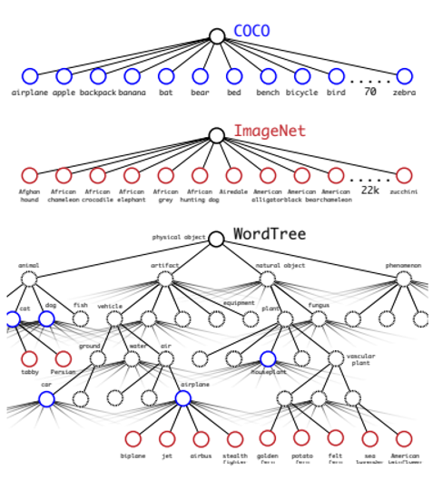

# TIL ( 2020/11/06 )

- Yolo9000: Better, Fater, Stronger

---

Yolo9000은 9000개에 클래스에 대해서 detection을 했고, YOLOv2의 모델을 사용했는데 YOLOv2는 PASCAL VOC 2007에서 67 FPS 78.8mAP성능을 보여줬고 COCO에서는 46FPS 78.6mAP의 성능을 보여주었다. 또한, YOLO9000은 ResNet과 SSD를 사용하는 Faster RCNN과 같은 sota방법보다 더 빠른 속도를 보여줬다고 합니다. 

#### Introduction

YOLO9000에서 classification dataset과 detection dataset을 섞어서 joint training하는 방법을 제안하고 있고 기존에 YOLO detection에 단점을 보완한 YOLOv2를 보여준다. YOLO-v1에 단점은 실시간을 가능하게 했지만 성능이 좀 떨어지는 문제와 recall이 떨어지는 문제가있다(찾아내는 개수가적다).

#### Better

##### Batch Normalization

Batch Normalization을 모든 convolutional layer에 사용하여 mAP를 2%상승시켰고 dropout을 overfitting없이 제거했다.

##### High Resolution Classifier

CNN의 경우 training하는 과정이 필요한데 YOLO-V1은 학습시에 image-net(224x224)를 사용해서 학습을 시키고 detection을 할 때는 448x448로 resize를 하여 네트워크를 통과시키는데 이 때문에 network가 input size에 다시 적응을 해야하는 문제가 생긴다. 그래서 YoLO-v2에서는 448x448로 10epoch fine tuning을해서 성능을 4% 향상시켰다. 

**Convolutional with anchor boxes**

YOLO에서는 fc layer를 통해서 b-box를 직접 찾아냈지만 R-CNN기반에 Region Proposal Networks는 미리 사전에 정의된 anchor box를 통해서 어떻게 조절할지를 학습을  한다. 

YOLO-v2에서는 fc layer를 다 없애고 con layer로 바꿔서 anchor box에 개념을 도입시켰다. YOLO에서 pooling이 5번일어나서 이미지의 크기가 1/32로 줄어들게 되는데 그 때 해당 이미지의 width와 height를 홀수의 값을 갖게 하기 위해 Input image 크기를 448x448에서 416x416으로 수정했다. 홀수로 맞추는 이유는 많은 객체들 특히 큰 객체들이 detection에 문제 풀 때 가운데에 있는 경우가 많은데 홀수 일 경우 grid cell에서 정확히 중심점을 잡을 수 있기 때문이다.

YOLO을 생각해보면 각 grid cell에 class를 지정해놓고 b-box를 2개씩 잡았는데 해당 논문에서는 모든 anchor box마다 prediction한다. Anchor box를 사용한 mAP 결과가 0.3낮게 나왔지만 recall은 7%나 증가한 것을 보여주고있다. 

##### Dimension Cluster

YOLO에 anchor box를 적용했을 때 두가지의 문제가 있는데, Anchor box를 적용했기 때문에 anchor box를 몇 개나 사용할 것 인가를 정의해주어야 하는데 YOLO-V2에서는 dataset에 맞는 최적에 anchor box를 학습시키기위해 k-means clustering 방법을 사용했다. 좀 더 보자면 큰 anchor box의 경우 GT box와의 거리만을 계산할 경우 오차율이 더 커질 수 있기 때문에 IOU를 이용하여 clustering을 해줬다고 한다. 

##### Direct location prediction

YOLO에 anchor box를 사용할 때 또 다른 문제점은 초기에 box에 x, y의 값을 정할 때 발생한다. Anchor box의 경우 초기에 정의가 잘 되어있지 않기 때문에 anchor box를 왼쪽위에 지정했다고 하더라도 엉뚱하게 상관없는 오른쪽 맨 아래의 위치로 이동해 버릴 수 있다. 그래서 YOLO-V2에서는 기존에 anchor box에 width, height의 공식을 그대로 사용했지만 x, y 좌표에 대한 식은 direct prediction을 하게 만들었다.

그래서 위에 그림을 보면 하나의 grid cell비율에 sigmoid를 사용해서 grid cell에 범위를 넘지 않게 하는 방법을 사용하여 어떤 grid cell에서 만들어낸 b-box의 중심은 항상 해당 grid cell안에 존재하도록 한 것을 볼 수 있다. 이 방법을 통해 anchor box를 그냥 사용 했을때 보다 5%향상 됐다고 한다. 

##### Fine-Grained Features

맨 마지막 단에 feature map이 13x13인데 이전에 26x26의 map을 가져와서 4개로 나눈다음채널별로 13x13에 concat을 한 뒤 b-box를 뽑아낸다. 이를통해서 1% 성능에 향상을 보였다.

 

##### Multi-Scale Training

FC layer를 없애 버렸기 때문에 input size를 자유롭게 바꿀 수 있어서 학습시에 여러 scale를 통해 학습을 한다. 이를 통해서 나오는 각 결과물은 해당 이미지를 통해 알수있다. 

#### Faster

Darknet-19 network는 3x3 filter를 사용하는 VGG와 거의 유사하고 마지막단 쯤에 global average pooling을 사용했다. 1x1 convolution을 통해 채널을 1000개로 만들고 global average pooling을 하면 1000개에서 각 채널 전체를 하나로 만들어주기 때문에 이를 softmax해주는 방식으로 진행을 했다(global average pooling을 사용하면 parameter를 획기적으로 줄일 수 있다.).

 

Detection을 위한 training을 할때는 global pooling을 짤라내고 1024개의 필터를 통해 3x3 conv layer를 추가해서 1x1 conv layer를 추가해서 5개 box와 5개의 coordinate가 나오게 되고 5개 bounding box에 대해서 각각 20개의 클래스를 예측한다.

#### Stronger(YOLO9000)

ImageNet dataset과 detection dataset을 합치는 과정을 보여주는데 이 두개의 데이트를 합칠 때 계층을 나타내주는 WordNet(directed graph)이라는 개념을 도입한다.  만약 아래와같이 terrier라는 카테고리 하위에 Norfok, Yorkshire, Bedlington이 있을 때 

각각에 대해서 conditional probabilities를 구하고 terrier가 나왔을 때 Norfolk 일 확률, hunting dog일 확률을 계산한 다음 이것을 정답과 비교를해서 cross entropy로 학습을 하게 된다. 

ImageNet에 label은 1000개와 COCO label 대략 200개 정도를 합치게 되면 intermediate node가 생겨나게 되는데 그것을 다 포함시켜서 1369개의 label을 만든다. 그 후에 정답의 label을 상위로 propagation을 시키고 같은 level(category)에 존재하는 것들끼리 softmax를 구한것에서 또 conditional probabilities를 구하고 상위로 올라가서 이 과정을 반복하여 dataset을 구성한다. 

